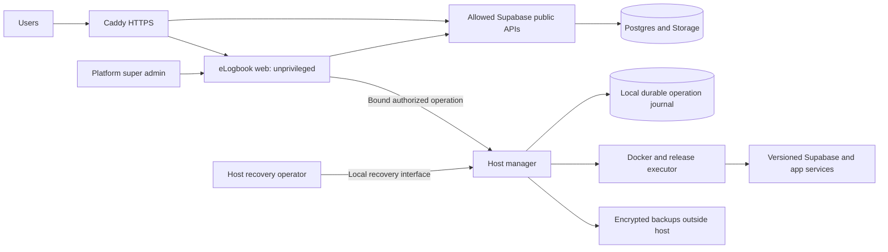

# eLogbook Master Upgrade Plan

Version: 1.0 | Prepared: 2026-09-07 | Owner: repository owner

Purpose: a self-contained implementation handoff for smaller coding models, grounded in the current repository. This is a plan and source review, not an implemented upgrade or a security certification. No plan can guarantee zero mistakes; the execution contract and release gates below make mistakes detectable and prevent unsupported completion claims.

## Independent Review Adjudication

Claude's review correctly identified the main delivery risk: this document can look like a normal 29-ticket feature backlog even though it contains several multi-disciplinary qualification programs. Treat the following as an amendment to the execution model:

- The 29 tickets are requirement containers, not a promise that one small model can safely implement them. T07 (backup/recovery), T08 (migration convergence), T09-T10 (host control plane), T19 (patient-data governance), T26 (performance), and T27 (release qualification) require an experienced owner and explicit review checkpoints. Smaller models may implement bounded substeps only after the architecture and threat model are accepted.
- `apps/ops` is a production control plane, not a small utility. Before T09 implementation, create its own threat model, API/schema document, trust-boundary diagram, failure/chaos matrix, key/token lifecycle, deployment model, and independent security review checkpoint. Do not ship it merely because its unit tests pass.
- Deliver the manual install, backup/restore, update, and incident runbooks before GUI automation. Use them to prove each operation on a clean host and an existing-install clone; the GUI is an automation layer over a proven procedure. This moves the runbook deliverable from T28 into T07, T08, T11, and T15 acceptance criteria.
- T07 must name a key custodian, escrow/recovery ceremony, rotation and compromise response, partial-restore policy, and monitoring/alert owner before implementation. A phrase such as "protect keys separately" is not an operational design. Restore must be all-or-explicitly-partial with the resulting clinical and authorization state stated and tested.
- T08 must inventory every supported installation's actual migration history and define a per-state convergence or unsupported-adoption path. A checksum mismatch is evidence to stop, never evidence that a migration can be marked applied. No generic reconciler is acceptable without fixtures for each observed state.
- T19 is a phase of its own, even though it remains one parent ticket for traceability. Its substeps must be reviewed by the data-governance owner before identifiable mode is enabled. Offline reconciliation, historical identifiable records, all egress paths, retention, and revocation races are product/security behavior, not UI work.
- T26 separates baseline collection, bottleneck diagnosis, one measured fix, and regression qualification. It cannot be closed by reporting aspirational targets or by changing the targets.
- T27 is the release process. Split it into named qualification evidence packages and require sign-off from security, operations, accessibility, and product/data-policy owners. G8 is a hard enablement gate for identifiable mode, independent of de-identified pilot release.
- Rollback is a recovery decision with a bounded window and explicit data semantics. Every update manifest must state whether rollback is image-only, schema-compatible, or restore-based; which migrations are irreversible; the maximum supported window; expected data loss; and the exact operator action. "Compatible rollback" without those fields is a blocked release.

This adjudication does not reduce the requested scope. It prevents automation from hiding ownership and review work that the original ticket count could understate.

## 1. Start Here

Read this section, sections 2-5, and your assigned ticket before changing code. Implement one ticket at a time. Do not attempt this entire document in one prompt.

### Owner requirements

- Upgrade UI, design consistency, performance, security, and operational reliability.
- Preserve and refine the existing Apple Health-inspired identity; do not invent a new brand.
- Provide a GUI to install eLogbook and production self-hosted Supabase on a VPS using Docker.
- Let the platform super admin check for and initiate compatible eLogbook and Supabase updates through the GUI.
- Expand platform tenant management and tenant administrator settings.
- Support both de-identified and identifiable patient-record modes. Tenant admins select their tenant's mode within permissions controlled by the platform super admin.
- Provide platform and tenant theme controls and editorial control over public landing pages.
- Follow Karpathy's principles: think before coding, keep solutions simple, make surgical changes, and verify behavior.

### What this plan takes precedence over

For this upgrade program, use this document as the implementation roadmap. Preserve older documents as historical evidence; do not execute conflicting instructions from them in parallel.

| Existing document | Treatment |
| --- | --- |
| `PRODUCTION_UPGRADE_PLAN.md` | Retain useful security contracts; revalidate all old findings and completion claims against current code. |
| `LAUNCH_SCOPE.md` | Preserve the currently restricted pilot until the new release gates pass. The requested future product supports both patient-data modes; do not silently change today's pilot data permission. |
| `docs/superpowers/specs/2026-08-18-setup-wizard-design.md` | Replace the shared web-app/Docker-socket design with the isolated management design in section 5. |
| `docs/ULTIMATE_UPGRADE_PLAN.md`, `docs/LAUNCH_UPGRADE_PLAN.md`, `docs/ANALYSIS_AND_UPGRADE_PLAN.md`, `analysis/UPGRADE_PLAN.md` | Historical backlog only; reuse a task only after checking whether it already exists. |
| `.impeccable/critique/*` | Historical design observations, not current browser evidence. |

At T00, add pointers from the README and active planning documents to this plan. Do not rewrite historical findings to look as though they were measured today.

### Evidence vocabulary

- `OBSERVED`: source inspected; behavior inferred, not reproduced against the running system.
- `VERIFIED`: a specified command or behavioral test passed on a recorded tree and environment.
- `PROPOSED`: target architecture or task with no implementation implied.
- `BLOCKED`: required verification cannot run; name the prerequisite. This is never a pass.
- `DONE`: implementation, relevant tests, review, and evidence for that ticket are all complete.

## 2. Current Repository Assessment

### Inspection stamp

Base commit: `22e1d636e64fa2c2c6eb8784d2d68c287ecf99b1`.
Environment: Windows/PowerShell, Node `v22.23.1`, pnpm `9.15.0`.
The working tree was already dirty. In particular, `apps/web/next-env.d.ts` was modified and several review/QA artifacts were untracked. They were not reverted. Evidence from this review does not establish a clean release artifact.

Inspection covered manifests, container definitions, CI, the setup/update/backup helpers, authentication and tenant guards, relevant migrations, branding, the app shell, landing implementation, and test configuration. It was a targeted architectural review, not an exhaustive endpoint audit or penetration test. No live database, production records, or secret values were needed.

### Existing foundations to retain

| Area | Existing implementation |
| --- | --- |
| Web | Next.js App Router, React, TypeScript, Tailwind, next-intl; `apps/web`. |
| Mobile | Expo/React Native with offline-related code; `apps/mobile`. Preserve compatibility even while web ships first. |
| Shared | Types, Zod schemas, components, design tokens; `packages/shared`. Environment validation in `packages/env`. |
| Backend | Supabase migrations, database tests, Edge Functions, RLS policies, storage, auth, audit, billing, and integrations. |
| Main workflows | Case wizard, cases, approvals, dashboards, reports, goals, evaluations, duty hours, invitations. |
| Admin | Users, templates, billing, SSO, SCIM, AI configuration, webhooks, retention, white-label form. |
| Operations | Existing `/setup`, `/update`, backup screens, setup helpers, Compose, health and readiness handlers. These need substantial correction. |
| Tests | Vitest, Playwright, pgTAP-style SQL tests, source scanners, security workflows. Passing a scanner is not integration proof. |

### Findings that determine implementation order

Line references are inspection anchors, not permanent identifiers. Re-read the surrounding implementation before editing.

| ID | Priority | Evidence and implication | Ticket |
| --- | --- | --- | --- |
| F01 | P0 before installer exposure | `setup.docker-compose.yml:13` publishes port 3000 and mounts the Docker socket into the web container. It sets `NODE_ENV=production`, while `apps/web/proxy.ts:29` and setup handlers reject production. The advertised installer topology is internally incompatible. Keep its guard until separation is complete. | T06, T09-T12 |
| F02 | P0 before updater exposure | `apps/web/app/api/update/execute/route.ts` runs `git pull`, builds, and restarts synchronously inside the application being updated. It has no durable job, verified release manifest, or reliable rollback, and is production-disabled. | T13-T16 |
| F03 | P0 recovery | `apps/web/lib/setup/backup-manager.ts:117` uses a shell pipeline without `pipefail`; failed dumps can leave an apparently valid gzip. Restore lacks `ON_ERROR_STOP`, does not restore all copied assets, and can report success with a missing dump. Integrity checks only file existence. The manifest treats a Caddyfile as certificate evidence; retention can violate the minimum when over capacity. | T07 |
| F04 | P0 migration safety | `apps/web/lib/setup/db-migrator.ts:96` records an error then continues later migrations. It uses an unqualified custom `schema_migrations`, different from the CLI's migration history. Existing installations can drift or reapply migrations. | T08 |
| F05 | P0 release evidence | `.github/workflows/ci.yml:53` makes DB tests non-blocking; only two SQL suites are selected and the Deno job has `if: false`. `scripts/verify-boot.mjs` checks source strings despite runtime-oriented labels. No compiled boot or HTTP request is executed by that script. | T01-T02 |
| F06 | P1 update discovery | `apps/web/lib/setup/version-tracker.ts:88` still contains `{owner}`. Failed checks return `null`, conflating unavailable with up-to-date; the latest monorepo release is not a qualified Supabase stack update. | T13 |
| F07 | P1 self-hosting | `apps/web/proxy.ts:15` allows Supabase cloud domains in CSP but no configured custom Supabase origin. The browser client reads `NEXT_PUBLIC_*`; prebuilt images need a tested runtime configuration path. | T06 |
| F08 | P1 readiness | `apps/web/lib/supabase/middleware.ts:141` exempts health but omits `/api/ready` from public routes. Anonymous readiness requests can redirect to login before reaching the handler. Compose does not consume readiness for traffic gating. | T03 |
| F09 | P1 authorization | `requireTenantAdmin` validates user, tenant, and role but does not enforce AAL2 or active status. Middleware checks an optional top-level `session.aal` and swallows MFA failures. Layout enforcement is insufficient for direct API calls. Reproduce with real sessions. | T04 |
| F10 | P1 platform governance | `apps/web/lib/supabase/auth.ts:108` only permits the profile's own tenant. Its comment references an `admin_tenants` migration/table absent from the searched migrations; `00064` actually covers onboarding/SCIM. A real platform management model is needed. | T17-T18 |
| F11 | P1 theming | `custom_branding` is saved and previewed in white-label settings, but the search found no consumer applying those values to the tenant shell. Settings success does not prove visible branding. | T21-T22 |
| F12 | P1 UI consistency | `globals.css`, shared token files, and root fonts have overlapping definitions; the root sets `dir='ltr'`. Old critiques describe a different design state. Measure current pages and consolidate without a wholesale component rewrite. | T20-T23 |
| F13 | P1 containers | Active `apps/web/Dockerfile` installs without a frozen lockfile and its runner has no `USER`. Root `Dockerfile.web` is different and contains shell-like text in `COPY` instructions. Neither image was built in this review. | T06 |
| F14 | P1 auth test reliability | `apps/web/e2e/fixtures.ts` assumes `*.supabase.co` when deriving cookie names and falls back to fake localStorage tokens when real login fails. That cannot prove authenticated self-hosted flows. | T02 |
| F15 | P1 permission audit | `20260825230000_role_change_authorization.sql` permits an institution admin actor without restricting the destination role there. API handlers restrict assigning `admin`; test direct DB/API paths to establish whether the final schema permits privilege escalation. This is a source-level risk, not a reproduced exploit. | T04-T05 |
| F16 | P1 content management | Root landing copy is implemented in `apps/web/app/page.tsx` and `components/landing/LandingIslands.tsx`; no landing-page revision/publishing model was found in the inspected migrations. | T24-T25 |
| F17 | P1 proxy/config validation | `config/Caddyfile` disables the admin API while Compose healthchecks its admin endpoint; domain/TLS blocks and passed environment also need real Caddy validation. File existence cannot prove HTTPS works. | T03, T06 |

### Baseline checks performed for this plan

| Check | Result and limit |
| --- | --- |
| `pnpm typecheck` | VERIFIED: exit 0 for the current working tree. The older compilation-failure claim is stale. |
| `node scripts/verify-boot.mjs` | VERIFIED: exit 0; source inspection only, not runtime boot validation. |
| `node scripts/verify-security-tests.mjs` | VERIFIED: exit 0; selected suite presence checks only. |
| `pnpm test` | FAILED: exit 1. Web reported 31 test files passing, 322 tests passing and 1 skipped, but three workers timed out starting signup, pricing, and admin role-gating suites. The chained mobile run did not execute. This is not a passing test baseline. |
| `pnpm --filter @elogbook/web exec vitest run --maxWorkers=1` | VERIFIED diagnostic: exit 0, 34 web test files passed, 333 tests passed and 1 skipped, 184.44 seconds. No test configuration was edited. This does not erase the default-command failure or verify mobile tests. |
| `pnpm lint:all` | VERIFIED: exit 0 for web and mobile on the current working tree. |
| Docker/production Supabase | BLOCKED locally: no Docker executable found on PATH. No fresh install, image build, migration replay, restore, or upgrade was claimed. |
| Browser/performance/security assessment | Not executed for this planning change. UI findings are source observations, not current screenshots, measured performance, or exploit proof. |

Plan verification: 29 unique ticket IDs, no missing ticket dependencies or dependency cycles, balanced Markdown fences, ASCII text, and no trailing whitespace in the two new documents. Whole-tree `git diff --check` reports pre-existing whitespace in `apps/web/next-env.d.ts`; that file was not edited for this task. Application implementation remains unchanged by this planning work.

## 3. Small-Model Execution Contract

### Required loop for every ticket

1. Read current code and applicable repository instructions. Check `git status`; preserve others' work. Never assume this plan's line numbers or old status are still current.
2. State the ticket, dependencies, exact behavior, affected files, and verification command. Separate facts from assumptions. If a prerequisite is not done, work on that prerequisite.
3. For a bug or security boundary, add a behavioral regression test that fails for the identified reason. Record that failure. Tests must exercise real authorization boundaries where needed, not merely expected mock calls.
4. Make the smallest coherent change. Keep existing public exports and web/mobile contracts working. Prefer the local framework and libraries; no speculative abstraction, package replacement, or unrelated cleanup.
5. Run the focused test and required broader checks. A database or host operation requires integration tests in addition to mocks. A UI change requires actual browser verification.
6. Review the diff for secrets, authorization, error paths, migration compatibility, and accidental deletions. Ask what would falsify the claim that the ticket works.
7. Record results and remaining limitations. Only mark DONE with evidence. Stop after the assigned ticket or explicitly assigned batch.

Aim for one behavior and roughly 1-3 production modules per implementation step. This is a scope heuristic, not permission to leave a half-migration or broken export. Split large tickets into named substeps before coding; each integration point must compile. Broader changes require a written file list and rationale, not an arbitrary claim that they are mechanical.

### Forbidden shortcuts

- Do not remove tests, skip security cases, loosen assertions, enable `continue-on-error`, lower thresholds, or replace real authentication with stubs to obtain green CI.
- Do not rename applied migrations, edit historical migrations to hide a defect, run `db reset` against a real deployment, or use a new empty database as evidence that an upgrade works.
- Do not disable RLS, CSRF, CSP, MFA, TLS validation, or tenant predicates to make a feature work.
- Do not expose service credentials, signing keys, Docker sockets, arbitrary commands, user-supplied Compose files, or raw SQL through the application.
- Do not claim de-identification from a checkbox, regex, encryption, or hashing alone.
- Do not use `git pull main`, floating image tags, or `latest` as the production update mechanism.
- Do not make all logged-in admins platform operators, and do not equate platform infrastructure access with clinical-record access.
- Do not run production operations as part of a coding task. A release must be concretely reviewable before operator deployment.

### Ticket evidence template

```markdown
Ticket: Txx / substep
Status: PROPOSED | IMPLEMENTED | VERIFIED | DONE | BLOCKED
Base commit and working-tree fingerprint:
Files changed:
Behavior changed and reason:
Pre-change reproduction / failing assertion:
Commands, environment, exit codes, and artifact paths:
Security / tenant / patient-mode cases exercised:
UI screenshots or database/container evidence when applicable:
Compatibility and recovery result:
Unverified concerns / blocker:
Next dependency-ready ticket:
```

Store evidence under `docs/upgrade/evidence/Txx/`. Include no credentials, patient data, authentication cookies, or unsanitized traces. Record exact release image digests for container evidence. Protect evidence from alteration in the release workflow; a Markdown checkbox alone does not enforce this contract.

## 4. Security and Data Contracts

### 4.1 Roles and boundaries

Keep the existing role strings during the first migration. Use the UI label **Platform super admin** for a separately verified platform operator. Do not introduce a second ambiguous tenant role named `super_admin`.

| Actor | Allowed scope | Forbidden by default |
| --- | --- | --- |
| Resident | Own assigned clinical/training workflows within tenant policy. | Tenant settings, other residents' private data, infrastructure. |
| Supervisor | Assigned review workflows and permitted program views. | Tenant security settings, assigning administrative roles, infrastructure. |
| Director | Program configuration and authorized reporting. | Platform settings, updates, granting platform privileges. |
| Institution admin | Own tenant's members, approved settings, branding, data-mode choice, and integrations. | Raising platform ceilings, other tenants, host jobs, assigning platform operators. |
| Platform super admin | Tenant lifecycle, policy ceilings, global theme/content, platform access grants, approved infrastructure jobs. | Automatic access to identifiable clinical data; unrestricted shell from the web. |
| Host recovery operator | Locally authenticated recovery of this installation. | Browser-accessible generic shell or unrestricted remote management endpoint. |

Proposed authority model: an explicit `platform_admins` registry keyed to `auth.users.id`, with status and audited grants. Keep existing profile role values for compatibility. Migrate only owner-attested operator accounts into this registry; do not auto-promote every historical `admin` row. Platform admin grants require current platform authority, AAL2, recent reauthentication, and last-active-operator protection.

The current `profiles.user_id UNIQUE` means one home tenant per profile. Do not redesign all membership tables merely to build platform tenant administration. Add scoped platform metadata endpoints first. If support access to a tenant is required, use explicit expiring `platform_tenant_access` grants with purpose, actor, scope, expiry, and audit; no impersonation session, no blanket `admin OR ...` across RLS. Clinical access is a separate grant and release gate.

At every sensitive entry point, independently check identity, live account status, current authority, target tenant/resource, current policy, and required authentication strength. JWT metadata can be stale. Role revocation and tenant suspension must take effect for existing sessions on sensitive operations. Layouts and navigation filtering are usability, not authorization.

### 4.2 Tenant-selectable patient-data modes

Expose two choices: **De-identified training records** and **Identifiable patient records**. A tenant admin may select the latter only when the platform has enabled it for that tenant and this installation has passed its identifiable-data release gate.

Proposed fields, implemented in protected policy tables rather than editable branding JSON:

| Field | Writer | Meaning |
| --- | --- | --- |
| Installation `phi_ready` | Qualified deployment/release process, visible to super admin | Identifiable-data technical/operational gates have passed for this installation. A UI toggle alone cannot establish this. |
| Platform `allow_identifiable` | Platform super admin | Installation-wide ceiling; default false. |
| Per-tenant `allow_identifiable` | Platform super admin | Tenant-specific ceiling; default false. |
| Tenant `requested_mode` | Institution admin; super admin may override with reason | `deidentified` or `identifiable`; default deidentified. |
| Policy `version` | Database-controlled | Monotonic version for concurrency, cache invalidation, and sync enforcement. |

Effective identifiable mode requires all three permissions and the tenant request. Any unknown value or failed policy lookup denies identifiable writes. Record-level `is_deidentified` remains a classification with validated invariants; it is not the permission source.

| Installation qualified and globally allowed | Tenant allowed | Tenant selection | Result |
| --- | --- | --- | --- |
| No | Any | Any | Identifiable writes denied. |
| Yes | No | Any | Identifiable writes denied. |
| Yes | Yes | De-identified | Identifiable writes denied. |
| Yes | Yes | Identifiable | Identifiable records allowed subject to field permissions; de-identified entries may still be submitted. |

Enforce this transactionally in Postgres for direct REST writes, RPCs, imports, jobs, and sync, including privileged application paths. Tenant admins cannot update platform-owned columns through the Data API. Avoid a CHECK constraint that queries mutable settings; use reviewed transactional functions/triggers plus RLS and restricted grants. Coordinate policy changes and writes with compatible row locks so a concurrent revocation cannot race a write. Storage upload authorization needs the same policy and ownership checks; test signed URL lifetime and revocation limits.

De-identified mode must reject identifier fields, identifying attachments, and prohibited template fields; minimize free text and warn about residual identification risk. Audit notes, PDFs, filenames, AI requests, search indexes, notifications, webhooks, analytics, and error reports are part of the same data boundary. Never treat hashing an MRN as automatic de-identification.

Changing identifiable to de-identified immediately stops new identifiable records and identifier edits. Preserve existing records and their classification; do not clear fields, delete data, or flip `is_deidentified` automatically. Existing identifiable records move to a restricted historical workflow for explicitly authorized custodians, with read/export audit and no ordinary mutation. Normal screens must not relabel these records as de-identified. Super admin can separately suspend clinical access for an incident. Permanent conversion/removal requires a separately reviewed, resumable data job accounting for attachments, exports, indexes, retention holds, and backup expiry.

A stale browser or offline mobile queue never overrides current server policy. Reject incompatible queued writes without echoing identifiers in errors; let the user resolve or discard them securely. Schema/API changes must preserve older supported clients' safety even if they cannot display the new settings.

### 4.3 Other non-negotiable controls

- Inventory every tenant table, view, function, storage bucket, Edge Function, background job, export, and service-role call. Test two real tenants and anonymous/authenticated/privileged roles.
- Use `USING` and appropriate `WITH CHECK`, scoped references, explicit grants, and safe function search paths. Review final schema after all migrations, not just migration text. RLS does not constrain service-role clients.
- Enforce AAL2 and recent reauthentication for platform permissions, updates/restores, security policy, and credential changes. Fail closed on assurance lookup failure; production cannot silently honor a global MFA bypass for these actions.
- Limit bytes actually read, validate Zod schemas, reject unexpected fields where security-relevant, cap pagination/uploads, and return sanitized errors with correlation IDs.
- Bind CSRF checks to trusted configured origins. Exempt only exact signature-verifying webhook routes; a header's mere presence is not proof of a valid signature.
- Constrain outgoing URLs for webhooks, AI endpoints, branding fetches, and tests. Block metadata/loopback/private ranges where external access is intended, redirects to blocked hosts, and DNS rebinding. Internal deployment endpoints use a separate exact allowlist.
- Use least-privilege DB credentials for each operation. Keep service keys server-only; scan browser bundles, logs, source maps, backups, and release artifacts for leakage.
- Audit the existing encryption implementation before replacing it: verify authenticated encryption where applicable, nonce handling, key versioning, access to decrypt functions, rotation, and recovery of older ciphertext. Use established cryptographic libraries and tenant-scoped authorization; encryption does not replace RLS. Protect external transport with validated TLS and document volume/object-store encryption and key custody.
- Keep clinical content out of telemetry and session replay. Tenant integrations default to no identifiable data egress. Use explicit, audited policy for any authorized egress.
- Audit security changes atomically with the mutation, or use a durable transactional outbox. An audit failure must not silently yield a successful high-impact mutation. Do not log secret values.
- Do not claim regulatory or accreditation compliance from code alone. Keep jurisdiction, retention, consent, contractual requirements, and validation evidence documented for the actual operator and deployment.

## 5. Target Deployment and Operations Architecture

### 5.1 Separate application and host management



Proposed boundaries:

- `apps/web` runs production code as a non-root user with no Docker socket, host shell executor, installation secret files, or host directories mounted.
- Introduce one small `apps/ops` management service using the existing TypeScript toolchain and a production HTTP server. It owns bootstrap UI/API, durable jobs, and a narrow executor. Avoid a general remote-administration framework.
- Manager runs outside the application lifecycle and stays available while the app or Supabase is stopped. Its local journal must not depend on the Supabase instance it updates. Prefer SQLite with transactions, a single writer, and tested crash recovery over an in-memory queue or JSON file.
- Use a Unix socket with filesystem ownership for app-to-manager transport on the initial Linux topology. If TCP is later required, use private networking and mutual TLS. Neither a private network nor caller-supplied role fields are authorization.
- Manager independently validates a short-lived operator credential, verified AAL2, current operator authority, installation ID, exact operation, release digest, and idempotency key before accepting work. The web container must not hold an all-powerful manager signing secret.
- Persist an immutable, bounded, authorized execution plan before any planned Auth/DB shutdown. It permits only its recorded continuation/recovery steps during the outage. Do not accept new browser jobs while authorization dependencies are unavailable. Define authorization expiry and check it again before starting disruptive work.
- The executor accepts typed operations such as install, inspect, backup, apply-qualified-release, and recover. It never accepts arbitrary commands, paths, Compose YAML, SQL, image repositories, or shell fragments from a browser.
- Rootful Docker authority is host-equivalent even inside a container. Isolation reduces exposure; it does not make Docker safe by itself. Restrict executor files, commands, images, network access, logs, and package/update sources; test compromise assumptions.
- Bundle manager updates separately with supervisor/recovery support; never let it destroy its own recovery path while updating the app.

Do not enable the existing production-disabled setup routes as an intermediate step. Extract only reusable validated logic and remove privileged helper imports from the web artifact. Later web update routes may act as narrowly authorized status/submit proxies; they contain no Docker execution.

### 5.2 Supported first topology

Start with one explicitly tested Linux VPS profile: Ubuntu 24.04 LTS, x86_64, Docker Engine and Compose versions pinned in the qualified release. This is a proposed support boundary, not a new dependency upgrade instruction. Add ARM64 or other distributions only with actual installation and restore evidence.

Budget the complete app plus Supabase plus backup/upgrade headroom. Provisional validation profile: 4 vCPU, 8 GB RAM, 80 GB SSD with off-host backup storage; benchmark before promising capacity. Supabase's published minimum is not eLogbook's tested capacity. Require enough free space for old/new images, a full backup, temporary restore rehearsal, and database growth.

Public ingress: 80 for HTTPS redirection/ACME and 443 for the app and an explicitly configured Supabase API origin. Keep database, pooler, Studio, postgres-meta, Docker, and ops endpoints private. Route only necessary Auth/REST/Storage/Realtime/Functions endpoints; protect Studio separately. Verify WebSockets, upload sizes, timeouts, DNS, certificate renewal, and trusted proxy headers.

Use one authoritative web Dockerfile, frozen dependency installation, non-root runtime, read-only filesystem where feasible, writable paths explicitly mounted, dropped capabilities, `no-new-privileges`, resource limits, log rotation, digest-pinned images, healthchecks, and persistent named volumes. Caddy admin API and its healthcheck must agree. Do not treat a Compose health status as automatic traffic withdrawal or restart behavior.

### 5.3 GUI bootstrap contract

A browser cannot install an agent onto an empty VPS by itself. Support one documented initial host step: a verified release launcher run by the VPS owner, or equivalent cloud-init supplied in the VPS provider GUI. This installs prerequisites and starts the private bootstrap manager. Do not collect the owner's SSH root password in the app.

Bootstrap access is localhost through an SSH tunnel by default; optionally provision a verified HTTPS management origin with a short-lived one-time token. No public unauthenticated HTTP wizard. Generate a high-entropy token, store only its verifier, expire it, throttle attempts, establish an HttpOnly session, enforce origin/CSRF checks, prevent concurrent claims, and never put the token in logs or telemetry.

| Step | Required outcome | Failure behavior |
| --- | --- | --- |
| 1. Claim installation | Bind one authenticated setup session to installation ID. | Expired/used token denied; owner can regenerate locally. |
| 2. Preflight | Validate OS/architecture, Docker/Compose, actual resources, disk/inodes, DNS, ports, clock, registry access, and installation ownership. | Actionable result; unknown critical check blocks continuation. |
| 3. Domains and services | Choose app/API domains, SMTP, timezone, backup destination, and local Supabase or existing compatible Supabase. | Validate endpoints without unrestricted SSRF; preserve existing settings. |
| 4. Review | Show versions/digests, storage paths, resources, public ports, and expected duration. | No infrastructure changed before review succeeds. |
| 5. Provision | Fetch verified release assets; generate keys using the pinned Supabase release tooling; start stack; wait for real service readiness. | Bounded retry, durable step state, sanitized logs; preserve volumes. |
| 6. Schema and functions | Apply application migrations using the authoritative history; seed only production reference data; deploy compatible Edge Functions and required scheduled jobs/secrets. | Stop on first migration error; never seed demo accounts. |
| 7. Operator and tenant | Create initial platform operator exactly once, enroll MFA/recovery, create first tenant, and select data policy. | Resume partial setup without duplicate identities or privileges. |
| 8. Verify and hand over | Test browser auth, data API, RLS, file access, URLs, SMTP, backup/restore readiness, and application readiness. | Keep failed installation in a recoverable setup state. |
| 9. Close bootstrap | Persist final installation record, revoke setup token/session, close bootstrap ingress, and expose only authenticated management. | A restart or deleted marker cannot reopen bootstrap ownership. |

Progress represents real persisted steps. Refresh/reconnect resumes the same operation. Support retry of a failed idempotent step and cancellation before irreversible steps; never turn cancellation into automatic deletion of databases or volumes. Existing installations use an explicit adoption workflow with inventory and backup, not a fresh-install overwrite.

### 5.4 Release and update contract

An update is a qualified release transition, not simply a newer tag. Publish a signed manifest for each eLogbook release with:

- Manifest schema version, channel, release ID, source commit, issue/expiry times, and minimum supported manager version.
- App/manager image digests and platform architectures; migration checksums and from/to schema compatibility.
- Exact compatible Supabase self-hosted release and per-service image/config digests, including gateway, Auth, Postgres, Storage, and Functions.
- Supported source releases, intermediate upgrade hops, preflight requirements, expected downtime, health assertions, and forward/recovery strategy.
- Backup requirements, known breaking changes, release notes, SBOM and provenance, signing identity, and verification policy.

Use an established signature/provenance mechanism such as Sigstore/cosign under a documented trust policy; do not invent cryptography. Pin trusted issuer/repository/workflow identities, support signing-key rotation and revoked releases, reject expired/replayed/untrusted metadata, and distinguish a deliberate recovery downgrade from a normal update. Never accept a client-supplied release URL as authority.

Use current Supabase `self-hosted/v*` release metadata and its documented update tooling at a pinned revision. Run configuration merge/preview on a staged copy, inspect conflicts and required manual steps, and compare the tested bundle. Do not feed affirmative input into an unknown upgrade prompt. Preserve operator overrides; unexplained drift or a merge conflict blocks automatic application. Current tooling does not replace data backup.

GUI states must distinguish `up_to_date`, `update_available`, `unsupported_transition`, `check_failed`, `offline`, and `unknown_current_version`. Show current/target versions, exact components, compatibility, downtime, backup status, and reasons an Update action is unavailable. Managed-cloud Supabase is externally managed: show that state and do not offer a host update action.

### 5.5 Durable execution and recovery

```text
queued -> validating -> acquiring_lock -> backing_up -> backup_verified
       -> staging -> maintenance -> migrating -> switching -> verifying -> succeeded

Failure before mutation -> failed (existing deployment retained)
Failure after mutation  -> recovering -> recovered | needs_operator
Cancelled before mutation -> cancelled
```

One installation-wide lock serializes update, restore, and conflicting configuration jobs. Add DB advisory locking for migrations. Each transition is persisted with operation ID, attempt, timestamps, bounded logs, and a monotonic fencing token so an old worker cannot continue after a takeover. Repeated requests return the same job; conflicting requests return 409. API submission returns 202 promptly, with polling or reconnectable events for progress.

Write the recovery record before modifying state. Use exit codes, real readiness, and observed digests; never infer success from a request being sent or a file existing. The manager must survive app restart, browser closure, host reboot, registry failure, database unavailability, and interrupted network transfers.

For compatible application updates, pre-pull images, use expand/contract migrations, run the candidate, verify readiness and core workflows, then switch proxy traffic and drain old requests. Apply maintenance mode when safe coexistence is impossible. Support existing clients, service-worker caches, and open sessions through the compatibility window.

Maintenance must fence all writers, including direct Supabase REST/RPC/Storage clients, Edge Functions, cron, webhooks, imports, and mobile sync. A banner or application-only flag is insufficient. Preserve queued external deliveries with idempotent replay after recovery. Record exactly which already-issued upload/download URLs remain usable and bound their lifetime; freeze object mutations for a consistent recovery point.

Automatic app image rollback is allowed only if the schema remains compatible. A database restore is a separate data-loss decision with an explicit recovery point and write fence. Never pair an old image with an incompatible migrated schema. Postgres major upgrades, destructive migrations, unsupported Supabase transitions, or unresolved configuration changes enter a guided maintenance procedure until that exact transition has been rehearsed and qualified. The GUI can initiate qualified routine updates with one confirmed action; it must not pretend every future database upgrade is safely automatic.

### 5.6 Backup contract

Define backup sets that include Postgres application/auth/storage metadata and required roles/grants, actual object bytes, compatible stack configuration, release manifests, migration history, and all necessary encryption keys through secure key escrow. Database dumps alone do not contain stored files. A configuration backup alone does not contain the database. Copying live Postgres volume files without a database-consistent backup procedure is prohibited.

Use proven database/backup tools; check each process exit code and checksums. Encrypt backups before off-host transfer; protect keys separately, restrict access, support retention holds, and preserve at least the configured minimum verified recovery sets. Retention deletes oldest eligible sets, never the only verified backup to satisfy a disk quota. Alert and block updates on insufficient capacity.

Coordinate database and object-store consistency with a write fence or a tested point-in-time strategy. Verify each pre-update set, and restore it into an isolated target before high-risk updates. Periodic full restore drills must test auth, encrypted record readability, attachments, tenant isolation, and record invariants. Keep backup downloads out of ordinary tenant/admin APIs; an installation backup crosses all tenant boundaries.

Restore into maintenance mode. Before enabling traffic, reconcile post-backup operator revocations, tenant suspensions, data-mode restrictions, deletion obligations, and retention holds from a protected recovery record. Invalidate restored sessions where appropriate. A restore must not silently re-enable a revoked admin or a tenant's identifiable-data permission. Test this explicitly with a backup that predates the revocation.

Proposed pilot objectives: recoverable daily off-host backup with RPO <= 24 hours and measured RTO <= 4 hours on the qualified dataset; pre-update backups must reflect the fenced state immediately before mutation. These are targets until drilled. Define stronger objectives before identifiable-data operation if the operator requires them. A backup on the same VPS is not disaster recovery.

## 6. Platform and Tenant Administration

Create a clear `/platform` area for verified platform super admins; keep `/<tenant>/admin` scoped to tenant settings. Reserve platform/system slugs and update middleware deliberately so `/platform` is not mistaken for a tenant.

| Platform section | Functions and controls |
| --- | --- |
| Tenants | Search, paginate, create, activate, suspend, archive, inspect health/usage, assign tenant admins, and record reasons. No silent destructive deletion. |
| Tenant policy | Patient-data permission ceiling, tenant mode override, approved features/limits, retention bounds, allowed integrations, and branding/content delegation. |
| Identity and access | Platform operators, expiring support grants, session revocation, MFA policy, last-admin protection, invitation/recovery status. |
| Appearance | Global defaults, tenant override allowlist, contrast-safe presets, versioned preview/publish/revert. |
| Public pages | Platform landing, pricing/support copy, navigation/footer/SEO, media, drafts and publication history. |
| System | Installed versions, update checks, durable jobs, verified backup history, restore status, service health, sanitized diagnostics. |
| Audit | Filtered security events by actor, tenant, action, job, and time; constrained exports with audit. |

Tenant settings include profile/name/timezone, members and permitted roles, program/template settings, data mode, local branding, tenant public page where enabled, quotas/usage, retention within platform bounds, approved AI/SSO/SCIM/webhook integrations, notification preferences, and billing configuration where deployed. Inventory existing screens and wire their behavior rather than duplicating them.

Use the precedence rule: platform security ceiling > tenant administrative selection > personal presentation preference. Billing entitlements do not grant security permissions. A platform policy removal must immediately constrain API/DB behavior even if a client still displays the old UI.

Tenant suspension must cover direct REST, RPCs, Storage, scheduled tasks, and supported clients; UI read-only banners are insufficient. Define controlled data export/recovery for a suspended tenant separately. Use optimistic concurrency/version checks for settings, return 409 for stale edits, and make audit attribution explicit.

## 7. UI and Design Upgrade

### Direction and system

Retain the current neutral surfaces, blue action accent, familiar typography, and light/dark identity. Improve density, scanning, consistency, and contrast rather than introducing a marketing-style dashboard. Status colors need accompanying labels/icons and accessible foreground/background pairs. Preserve brand identity while making secondary semantic colors useful.

Inventory `apps/web/app/globals.css`, `apps/web/tailwind.config.ts`, `packages/shared/src/constants/design-tokens.ts`, `packages/shared/src/design-tokens.config.cjs`, root font setup, shared components, and native consumers. Select one authoritative token source and derive necessary outputs with existing tooling. Do not leave hand-maintained competing palettes or break native imports.

Target semantic tokens for backgrounds, text, borders, actions, states, spacing, fixed rem typography, radii, layering, focus, and motion. Use letter spacing 0, stable toolbar/table/button dimensions, restrained radii, and an 8px default for new cards unless an existing component convention requires otherwise. No nested cards or floating page-section panels. Keep clinical workspaces unframed and compact. Restrict blur to a justified overlay, not data surfaces.

Use the existing icon system, or adopt one library such as Lucide if none is consistently established. Tool actions use familiar icons with accessible labels and tooltips; numeric settings use numeric controls; binary settings use toggles; data-mode choice uses a radio/segmented selection with clear permission state. Buttons describe commands, not internal architecture.

### Workflow priorities

| Surface | Improvements to validate |
| --- | --- |
| Shell/navigation | Clear tenant and role context; grouped navigation; all permitted routes reachable on mobile; bounded sidebar; visible focus; route-aware breadcrumbs. |
| Cases | Keep existing pagination/filtering. Improve saved filters, meaningful empty states, status scanning, search feedback, return-to-list state, and narrow-screen rendering. |
| Case entry | Reuse existing wizard/quick-add, validate current policy, preserve safe draft state, show save status, focus first error, prevent duplicate submission, protect unsaved edits. |
| Approvals | Efficient review, explicit scope of batch actions, concurrent-change handling, no approving stale/revoked records. |
| Dashboard/reports | Prioritize tasks awaiting action, readable trends/tables, real loading/error states, consistent filters and exports. |
| Admin | Group settings by purpose; show inherited versus tenant values; preview effects; save/cancel/revert; visible audit and current data mode. |
| Setup/update | Persistent step status, real progress, reconnect support, actionable failure, version/backup/maintenance context. |
| Public pages | Preserve product identity, use real synthetic-data product screenshots, concise editorial content, and a usable signup/contact flow. |

Verify light, dark, system theme, desktop, tablet, mobile, 200% zoom, keyboard-only, reduced motion, long translated text, and RTL where supported. Preserve locale formatting and accessible labels. Do not mark Arabic support done until root direction, logical spacing, icons, tables, forms, and relevant native surfaces are verified.

### Tenant theme contract

Theme precedence: safe platform defaults -> allowed published tenant overrides -> personal light/dark/system preference. Tenant branding must apply on initial server render, navigation, reload, and published tenant pages. It must never leak across tenants through caches or browser persistence.

Support approved logo/favicon uploads, display name, primary action color with derived accessible state colors, density preset, and footer copy. Add constrained font/layout presets only if they solve a confirmed need. Do not expose arbitrary CSS, JavaScript, external tracking pixels, or HTML injection. Validate contrast at publication, validate assets by content/size, re-encode accepted raster uploads, and keep untrusted SVG/active content out of the initial upload pipeline.

Preview draft themes in an isolated scope; save a version, publish atomically, invalidate the correct tenant cache, and revert to a previous published version. A theme publish must not break security banners or hide required controls.

## 8. Landing-Page Editorial System

Use a small typed block model and the existing React rendering stack. A full drag-and-drop CMS framework is not required for the first release.

Proposed entities: `site_pages` (scope, locale, stable slug), immutable `site_page_revisions` (validated structured content and author), and a single current published revision pointer. Platform pages and tenant pages need an unambiguous scope representation with uniqueness constraints; never mix nullable scope fields without a CHECK enforcing the valid combinations.

Initial blocks: product introduction with screenshot, benefits, workflow, approved feature list, FAQ, CTA, and contact information. Add header/footer/navigation and SEO fields. Pricing amounts and feature entitlements come from authoritative plan data rather than independently editable promises. Do not publish unverified compliance claims.

Required editor behavior: draft autosave, validation, bounded text/media, preview at supported viewports, reorder/add/remove allowed blocks, publish, unpublish with fallback, revision history, revert, locale state, and conflict handling. Platform super admins control global pages and can delegate tenant-page editing within tenant scope. Drafts never enter public responses, sitemap, shared cache, or metadata.

Render structured content without arbitrary HTML/MDX execution. Validate link schemes, prevent script URLs and unsafe embeds, reject oversized/deep JSON, escape metadata/JSON-LD correctly, and sanitize any future rich text with a maintained allowlist library. Preview tokens must be expiring and scoped with no-store/noindex behavior; publishing is a separately authorized audited action. Uploads require scoped ownership checks and validated content.

Keep public pages fast through server rendering and narrowly scoped caching; cache keys must include tenant/scope, locale, page, and published revision. Publishing/reverting one tenant must invalidate only its pages. Authenticated root visits should continue to reach the user's workspace, matching existing behavior.

## 9. Performance Plan and Budgets

Measure before optimizing. The existing case list is paginated and the dashboard already batches some queries; do not claim to introduce those features from scratch.

Record production-build baselines on the qualified VPS using a reproducible synthetic dataset with at least two tenants and both permitted data-mode fixtures. Use 500 synthetic residents and 100,000 cases for the initial larger dataset, alongside a small pilot dataset. No copied patient records.

| Metric | Proposed acceptance target |
| --- | --- |
| Public/mobile web experience | p75 LCP <= 2.5s, INP <= 200ms, CLS <= 0.1 under a documented device/network profile; field data when available. |
| Authenticated list/dashboard API | p95 <= 500ms for agreed core reads at 25 concurrent active users on the qualified VPS, excluding third-party delivery time. |
| Interactive mutations | p95 <= 1s for core case/approval writes; long operations acknowledge a durable job promptly instead of blocking a request. |
| Main-thread work | No new unexplained long tasks on entry/review paths; capture traces, not just Lighthouse scores. |
| Assets/bundles | Record per-route transferred JS and image sizes; reject >10% unexplained regressions from the accepted baseline. Set absolute route budgets after measuring. |
| Recovery/soak | 24-hour pilot soak with no memory growth trend, unbounded job queue, or lost writes; enforce the recovery objectives in section 5.6. |

Targets are proposed requirements, not current measurements. Rebaseline only with evidence and owner-visible rationale; never relax a target silently to pass a ticket.

Investigate duplicate dashboard RPCs between layout and page, request waterfalls, exact-count cost, overly wide row selections, missing pagination on other screens, and RLS query plans. Use `EXPLAIN (ANALYZE, BUFFERS)` on isolated representative data with the real role/tenant and suitable indexes; never remove an authorization predicate for speed.

Keep server components for data work, narrow client boundaries, lazy-load heavy editors/charts, optimize product screenshots and fonts, and audit global providers and animation cost. Do not globally cache authorization or tenant data. Authenticated records and sensitive responses use private/no-store policies; public theme/content caches have explicit scope and invalidation. Service-worker caches must exclude clinical/authenticated payloads and clear relevant client state on logout/tenant changes.

## 10. Ordered Implementation Tickets

All tickets below are PROPOSED. Implementation and evidence determine completion, not their position in this file. Within a phase, work only on dependency-ready tickets. Each ticket follows section 3 and the applicable test matrix in section 11.

### Phase A: Establish trustworthy gates and fix existing boundaries

**T00 - Reconcile baseline and planning authority.** Dependencies: none. Read the package scripts, current Git state, README, this plan, and launch scope. Record the baseline and route/schema inventory; link the canonical plan and classify old findings as current/stale/unverified. Do not revert existing work. Acceptance: commands, tool versions, environment limits, and relevant original failures are recorded; no contradictory current-readiness claims remain in active documentation.

**T01 - Make CI security checks mandatory.** Dependency: T00. Files: `.github/workflows/ci.yml`, security/gates workflows, test scripts. Remove non-blocking DB behavior, enable isolated required Edge tests, include the maintained SQL inventory and shared-package tests, and require these statuses in release/branch protection. Test command validity through the installed tool's `--help` before standardizing scripts. Acceptance: an intentionally failing RLS/security test blocks merge/release; missing prerequisite causes an explicit failed/blocked job; no stale allow-failure path remains. Infrastructure startup retries may be bounded; failed security assertions must not be hidden by retries.

**T02 - Real production and self-hosted test harness.** Dependency: T01. Files: `apps/web/e2e/fixtures.ts`, Playwright config, `scripts/verify-boot.mjs`, new isolated integration harness. Separate public-page tests from authenticated fixtures. Use actual login and supported SSR cookie handling for cloud/custom/local origins; remove silent fake-auth fallback for protected tests. Add compiled-image route-manifest checks, HTTP boot/probe tests, and secret-free synthetic environments. Acceptance: absent credentials cannot make a protected suite green; bad auth, cross-tenant access, invalid production env, and presence of privileged setup execution in web fail the harness.

**T03 - Liveness, readiness, Caddy, and proxy contracts.** Dependency: T02. Files: `lib/supabase/middleware.ts`, `proxy.ts`, `/api/health`, `/api/ready`, Compose/Caddy. Ensure unauthenticated probes reach JSON handlers and carry no sensitive details. Define real timeout-bound dependency health and manager/proxy readiness consumption. Fix admin-off healthcheck contradiction and validate TLS/domain configuration. Acceptance: DB outage gives health 200 and ready 503 without auth redirects or loops; recovery restores readiness; direct app port is unreachable; spoofed forwarding headers do not bypass limits; actual HTTP->HTTPS and renewal path work on the test domain.

**T04 - Central current-authority and MFA enforcement.** Dependency: T02. Files: auth/tenant guards, admin routes, role-change/identity policies. Define a typed capability map with the existing roles; server handlers enforce live status and AAL2 where required. Inspect direct DB profile role changes, SSO default roles, invitations, SCIM, and every service-role mutation. Acceptance: institution admins cannot promote anyone to platform authority by REST/RPC/signup; disabled accounts and stale tokens cannot operate; AAL1/direct route calls and unavailable MFA services cannot bypass protected operations. Test both permitted and denied paths.

**T05 - Final-schema tenant/security audit and fixes.** Dependencies: T02, T04. Files: new migrations, `supabase/tests`, Edge Functions and affected routes. Enumerate RLS/force-RLS/grants/views/definers/storage policies and all privileged paths; inspect final catalog after fresh install and upgrade. Prioritize findings with real reproductions, including role escalation, inactive users, forged webhook exemption, exports, and SSRF. Acceptance: tenant A cannot read/write/reference tenant B resources through all exposed paths; no callable debug functions or demo users remain; each fix has a regression. Do not rewrite the migration history.

### Phase B: Reproducible deployment, backup, and migration foundation

**T06 - One portable hardened application image.** Dependencies: T02-T03. Files: active Dockerfile, Compose, `packages/env`, browser/server Supabase clients, CSP, build scripts. Consolidate Dockerfiles; use frozen installs and a non-root runner. Implement an allowlisted public runtime-config contract delivered before browser client initialization, so the same signed image works with different custom Supabase domains. Keep server/secret configuration separate. Acceptance: identical image digest works on two isolated domains with auth, refresh, Storage, Realtime, and CSP intact; no placeholder build URL, secret, Docker socket, or privileged executor in the app artifact; real container scan/build passes.

**T07 - Recoverable encrypted backup sets.** Dependencies: T02, T06. Files: replacement/extracted backup helpers in `apps/ops`, existing backup scripts, integration tests. Implement section 5.6 with verified streaming processes, complete manifests, off-host encryption, protected key escrow, and safe retention. Acceptance: restore to an empty isolated installation reproduces auth, data, roles, encrypted fields, and object bytes; failed dump/compression/upload/checksum prevents success; minimum retained sets and holds survive capacity pressure. No live data overwritten in tests.

**T08 - Authoritative fail-fast migrations.** Dependencies: T02, T07. Files: `lib/setup/db-migrator.ts` extraction, CLI adapter, migration inventory. Adopt supported Supabase migration history rather than inventing a parallel ledger; reconcile existing custom history by inspected checksums and schema evidence, never by blind marking. Lock execution, stop on first failure, handle documented nontransactional steps, and verify drift. Acceptance: clean install and at least one existing-version upgrade reach equivalent expected catalogs; rerun is idempotent; checksum mismatch/concurrent runner/failed statement blocks later migrations; old clients retain supported contracts.

### Phase C: Production GUI installer

**T09 - Isolated manager skeleton and bootstrap authentication.** Dependencies: T04, T06. New boundary: `apps/ops`, local journal, bootstrap launcher/Compose. Remove privileged setup helpers from web only after their replacement contract exists. Implement token claim, one installation owner, restricted transport, typed jobs, and initial no-op executor tests. Acceptance: anonymous/expired/replayed claims fail, production web cannot reach the Docker socket, manager rejects fabricated actor/tenant/command/path inputs, and restart never reopens bootstrap.

**T10 - Durable jobs and constrained executor.** Dependency: T09. Implement the state machine, idempotency, leases/fencing, locks, cancel points, command allowlists, log redaction/limits, and recovery journal. Validate child-process and Docker HTTP/stream error results. Acceptance: worker crash/reboot at every transition produces one authoritative continuation; duplicate submission starts one job; stale worker is fenced; arbitrary arguments and cross-installation jobs are rejected.

**T11 - Qualified Supabase bundle provisioning.** Dependencies: T07-T10. Add pinned upstream release adapter, exact config templates/overrides, key generation tooling, resource preflight, private networking, SMTP/Auth/API routing, Functions and migration orchestration. Acceptance: official bundle digests/config match manifest; two fresh VPS runs succeed; missing env/health/image/space blocks honestly; demo seeds are absent; private services are not reachable from outside; existing volumes are never overwritten.

**T12 - Complete GUI setup and adoption flow.** Dependencies: T10-T11. Adapt the existing wizard's useful steps to manager APIs and section 5.3. Add real progress/reconnect, first operator MFA, initial tenant/mode, readiness summary, setup closure, and explicit existing-install adoption. Acceptance: browser-driven installation completes from the one documented bootstrap step; interrupted steps resume safely; duplicate admin creation is prevented; bootstrap credentials stop working at completion; all supported browser/data workflows work on the resulting host.

### Phase D: Qualified one-action updates and recovery

**T13 - Signed release catalog and compatibility checks.** Dependencies: T06, T10-T11. Files: release CI, replacement version tracker, manifest schema. Publish immutable images and signed qualified manifests; resolve the actual repository/registry and signing identity during release setup. Acceptance: valid compatible releases appear; same/older/unsupported releases, tampered signatures, wrong issuer, stale metadata, revoked release, offline lookup, and rate-limited provider each produce the specified distinct state; no `{owner}` or `latest` source remains.

**T14 - eLogbook update executor.** Dependencies: T07-T08, T10, T13. Implement preflight, backup verification, maintenance if needed, expand/contract migration, candidate health, traffic switch, drain, and compatible rollback. Acceptance: N -> N+1 preserves case submission/approval/auth/object access; induced failure at each step produces the documented existing/candidate/recovered state; incompatible schema rollback is blocked; the durable job survives web restart and page reload.

**T15 - Supabase bundle updates.** Dependencies: T11, T13-T14. Wrap pinned upstream update tooling on staged config, detect three-way merge conflicts and upstream breaking steps, qualify exact source/target versions, and maintain data/key/Functions compatibility. Acceptance: one supported bundle transition passes restored-clone rehearsal and host test; configuration conflict/manual Postgres major upgrade is classified unsupported until qualified, without mutating the live stack; all Supabase services, auth, storage, RLS and realtime are verified afterward.

**T16 - Admin update/backup/recovery screens.** Dependencies: T12-T15, T17. Replace old synchronous update endpoints with authenticated job submission/status. Require platform authority, AAL2/recent auth, release review and backup status. Add maintenance/status banner, reconnectable progress, history, redacted diagnostics, and recovery point display. Acceptance: platform admin completes a qualified update through one confirmed action; tenant admins/directors are denied by API as well as UI; concurrent actions return 409; errors never become 'up to date' or fake success; management remains available during application outage.

### Phase E: Platform governance and both patient-data modes

**T17 - Platform operator authority and route boundary.** Dependencies: T04-T05. Files: new platform registry migrations/tests, auth helpers, `/platform` routes and navigation. Bootstrap/migrate only attested operators, protect grant/revoke and last-active-admin rules, reserve slugs, and keep metadata management separate from tenant records. Acceptance: existing tenant `admin` labels alone confer no host permission; platform management works without mutating a user's home tenant; tenant users cannot enumerate global settings.

**T18 - Tenant lifecycle and bounded settings.** Dependency: T17. Reuse tenant/member APIs where suitable; add platform tenant list/detail/create/suspend/archive, quotas, policy ceilings, and versioned settings. Add narrowly scoped expiring support grants only for a specified workflow. Acceptance: lifecycle actions are audited, suspension constrains direct APIs and jobs, stale settings conflict, last-admin protections hold, and metadata access grants no automatic clinical access.

**T19 - Dual data-mode enforcement and transition UI.** Dependencies: T05, T08, T18. Add protected policy schema/transactional enforcement and apply it to case forms, direct REST/RPC, sync/import/export, attachments, AI and integration egress. Implement section 4.2 exactly, including historical identifiable records and concurrency. Acceptance: all truth-table combinations and role/mode transitions pass against a real DB; platform revocation defeats stale clients and simultaneous writes; neither UI nor service-role code can bypass policy; switching off preserves historical data without misleading relabeling. Identifiable-data production enablement still requires G8.

### Phase F: Coherent UI, themes, and landing content

**T20 - Current UI baseline and shared design contract.** Dependency: T00. Files: `PRODUCT.md`, proposed `DESIGN.md`, token sources, UI inventory/evidence. Capture current key screens with synthetic data; specify typography, color/contrast, density, component states, icon conventions, and accessibility targets. Acceptance: owner-requested identity preserved; screenshots are current; tokens map to actual consumers; proposed visual changes are small enough to evaluate.

**T21 - Shared primitives and application shell.** Dependencies: T04, T20. Update tokens/selected existing components, navigation, form states, tables, dialogs, toasts, theme initialization, and locale direction. Work one component family at a time; preserve native contracts. Acceptance: core role workflows are reachable and usable on desktop/mobile, keyboard focus is correct, long text does not overlap, light/dark states meet contrast, and relevant web/mobile tests pass.

**T22 - Platform/tenant theme publication.** Dependencies: T18, T21. Extend existing `custom_branding` through validated versioned configuration, safe uploads, preview/publish/revert, platform ceilings, and initial-render consumers. Acceptance: a tenant-admin theme edit visibly applies after publication/reload with no flash or cross-tenant leak; disallowed/low-contrast themes cannot publish; platform restrictions and personal theme preference obey precedence.

**T23 - Clinical workflow polish.** Dependency: T21; patient-mode interactions also depend on T19. Improve cases/wizard/approvals/dashboard/reports using section 7. Split into one workflow per substep and retain existing useful features. Acceptance: real browser case create/edit/submit/approve/export flows pass in supported modes, concurrent updates fail clearly, errors preserve safe user input, and no visual regressions/overlap remain at required viewports.

**T24 - Safe editorial data and publication API.** Dependencies: T17-T18, T21. Add page/revision/publish models, strict structured blocks, scoped RLS, media validation, locale/slug constraints, audit, preview authorization, and atomic publication. Acceptance: tenant editors cannot change global/other-tenant content; anonymous clients cannot read drafts; injection/invalid URLs/oversized content fail; concurrent edits and publish/revert are consistent.

**T25 - Page editor and production renderer.** Dependencies: T22, T24. Adapt the current landing renderer and useful visual assets to published blocks; create editor/preview/revision views and missing-page fallbacks. Acceptance: owner can write/edit/reorder/preview/publish/revert global landing content; permitted tenant admins manage only delegated pages; signup/contact links work; public metadata, locale, published cache invalidation, accessibility, and mobile rendering pass.

### Phase G: Performance, adversarial verification, and release

**T26 - Measured application/database performance.** Dependencies: T06, T19, T23, T25. Capture traces/query plans/bundle sizes, fix measured bottlenecks one at a time, and establish accepted budgets. Acceptance: section 9 targets met or explicitly reported blocked, no authorization regression, no cross-tenant cached data, and no invented pre/post timings.

**T27 - Full release qualification.** Dependencies: T00-T26 for the complete planned feature release. Execute section 11 on clean artifacts and isolated representative hosts; perform restore/upgrade fault injection, security review, accessibility/browser matrix, load/soak, and old-client compatibility tests. Acceptance: gates G0-G7 pass for de-identified release; G8 additionally passes before identifiable use. Publish an accurate support matrix and known limitations.

**T28 - Operator handoff and staged rollout.** Dependency: T27. Produce operator install/update/restore/key-rotation/incident runbooks, sign release artifacts, verify branch protection, and rehearse on staging. Roll out to synthetic staging, then a small controlled pilot, then broader deployments after observed stability. Acceptance: operator can install, update, and restore using the GUI/runbook; health/backup alerts reach the configured operator; go/no-go and rollback ownership recorded; no production rollout is silently performed by the coding model.

### Dependency and delivery notes

- T17 can be completed before Phase D so T16 has real authorization. Phase labels group work, not permission to ignore explicit dependencies.
- T20 can run after T00 while infrastructure is being developed, but visual work must not bypass the security/release gates.
- Deliverable 1: trustworthy baseline and de-identified core deployment (A-B).
- Deliverable 2: tested GUI installation and platform authority (C plus T17).
- Deliverable 3: qualified update/recovery workflow (D).
- Deliverable 4: tenant governance, both-mode capability, appearance/editorial controls (E-F).
- Deliverable 5: measured, reviewed release with operator evidence (G).
- Estimate effort only after T00-T02 expose failures. This is a multi-release program, not a promise of production security within a fixed number of days.

### Mandatory decomposition for larger tickets

These are sequential substeps, not parallel-agent assignments. Apply the same evidence contract to each; do not mark the parent DONE until all its substeps pass. Number any further subdivisions in the ticket's evidence directory.

| Ticket | Required substep sequence |
| --- | --- |
| T01-T02 | Inventory commands and suites -> deterministic isolated fixtures -> required unit/shared jobs -> required DB/Edge jobs -> compiled-image probes -> branch/release enforcement. Preserve the recorded default Vitest startup failure until its cause and stable configuration are established. |
| T04-T05 | Enumerate entry points/final catalog -> reproduce profile/role/status risks -> fix and verify identity guards -> test views/definers/RPCs -> test storage/exports/jobs -> test external integrations/CSRF/SSRF. Make one proven defect fix per change. |
| T07 | Define complete backup manifest -> reliable encrypted capture -> off-host verification -> isolated restore -> retention/holds -> fault injection and recovery timing. |
| T10 | Persist operation/transition schema -> idempotent acceptance -> lock/fencing -> constrained executor -> crash/reboot recovery -> observable cancel/status behavior. |
| T12 | Claim/preflight screens -> domains/service inputs -> provisioning progress -> operator/MFA setup -> tenant/policy setup -> handover/closure -> separate adoption workflow. |
| T14-T15 | Read-only compatibility preview -> staged artifacts/config -> verified backup/write fence -> migration/service transition -> candidate verification -> traffic switch -> recovery fault matrix. |
| T18 | Tenant read/list/create -> membership administration -> bounded versioned settings -> suspension/archive enforcement -> optional explicitly scoped support access. |
| T19 | Protected policy schema/truth-table tests -> transactional DB enforcement -> API/RPC/import/sync parity -> case/attachment UI -> historical-record transition -> egress/export controls -> concurrency/revocation tests. |
| T21-T23 | Token ownership -> one primitive family -> shell/navigation -> theme initial render/publication -> one clinical workflow -> responsive/accessibility regression sweep. |
| T24-T25 | Scoped content/revision schema -> validated render blocks -> draft/save API -> preview isolation -> atomic publish/revert -> editor controls -> metadata/cache/locale verification. |

Every high-risk substep must define a concrete negative assertion. Examples: a failed database dump produces no verified backup; the second concurrent update starts no executor; an institution admin REST request assigning platform authority leaves the target unchanged; a stale identifiable write after policy revocation fails with no stored identifier. These are stronger acceptance criteria than screenshots or successful HTTP status alone.

## 11. Required Verification Matrix

| Gate | Required proof |
| --- | --- |
| G0: Provenance | Clean release commit, frozen lockfile, exact toolchain, image digests, SBOM, signature/provenance verification, supported platform matrix. |
| G1: Build and tests | Typecheck/lint/unit/shared tests, production build and boot, all required SQL/Edge suites, no swallowed/skipped security failures. |
| G2: Authorization | Real two-tenant tests for every role, active/suspended users and tenants, AAL1/AAL2, stale/revoked claims, direct REST/RPC/Storage/exports/jobs, forged IDs and role assignments. |
| G3: Installation | Fresh Linux host and existing-install adoption, secure bootstrap, complete Supabase/Functions setup, default-deny ingress, browser login/refresh/file/Realtime, setup permanently closed. |
| G4: Recovery/update | Verified encrypted off-host backup and full restore, failed dump/upload/restore, conflicting jobs, interrupted/rebooted updater, invalid signatures, incompatible schema, actual N -> N+1 -> compatible recovery. |
| G5: UI/accessibility | Real Playwright/axe plus manual keyboard/screenshots at 360x800, 768x1024, 1440x900 and wide desktop; light/dark, 200% zoom, reduced motion, loading/empty/error/long text, RTL where supported. No serious/critical accessibility failures without resolution. |
| G6: Content/theme | Publish/preview/revert, draft confidentiality, safe URLs/assets, injection corpus, contrast validation, policy precedence, tenant cache isolation, reload and cross-tenant navigation. |
| G7: Performance/operations | Production baselines, load/soak, resource headroom, readiness and real alert delivery, backup age alerts, redacted diagnostics, documented RPO/RTO achieved. |
| G8: Identifiable data | Effective-mode truth table, stale/offline/concurrent writes, complete egress/storage/export controls, encryption/key recovery, historical-mode transitions, retention/incident procedures, and independent security assessment with blocking findings resolved. Operator records applicable legal/contractual approval separately. |

Minimum fault-injection cases: unavailable registry, disk full/inodes exhausted, corrupt image/manifest/backup, wrong signer, expired bootstrap/operator token, partial migration, DB restart, Storage unavailable, expired certificate, proxy misconfiguration, killed manager, expired lock/stale worker, repeated HTTP submission, browser closed, stale theme/page editor, revoked role mid-operation, and tenant data-mode revocation during a write/sync.

Run tests against a dedicated throwaway Supabase stack, not a linked production project. Name isolated resources and verify target identity before destructive cleanup. Do not assume passing `pnpm test` runs shared or SQL suites: root `test:unit` currently invokes web and mobile only, while the shared package has tests but no test script. T01 must make complete coverage explicit.

Existing command inventory to validate/use during T00-T02:

```text
pnpm typecheck
pnpm lint:all
pnpm test
pnpm build:web
pnpm test:e2e
node scripts/verify-boot.mjs
node scripts/verify-security-tests.mjs
```

Database, container, security-scan, shared-test, and release commands must be checked against the installed tool versions and fixed scripts first. In particular, the existing `security:scan` expects an image named `elogbook-web:scan`; do not claim it scans a release unless that exact artifact was built and identified. Do not use commands in this document as authorization to reset or deploy a live system.

## 12. Handoff Prompt for a Smaller Model

Use this with one ticket ID substituted. Include the repository and this file, not just a short summary.

```text
Implement ticket Txx from ELOGBOOK_MASTER_UPGRADE_PLAN.md.

Read sections 1-5, the assigned ticket, its dependencies, and section 11.
Read applicable repository instructions and the actual files before editing.
Preserve existing unrelated changes. Do not implement other tickets.

First report: current ticket/dependency status, source observations, exact behavior,
files to touch, and meaningful verification commands. Split the ticket into
small compiling substeps if needed. Do not ask me to approve routine reversible
implementation choices already covered by the plan.

For a bug/security boundary, show a failing behavioral regression first, then
the smallest fix, then the passing result. Real database/host behavior needs
integration evidence; mocked tests and source-string checks are insufficient.
Do not weaken tests or security controls to get green output.

Preserve the existing visual identity. Enforce tenant selection of patient-data
mode within platform permission ceilings, including historical records and stale
clients. Platform operator authority never implies unrestricted clinical access.

Finish with changed files, behavior, commands and exit codes, artifact paths,
rollback/compatibility evidence, and anything not verified. Mark DONE only after
the ticket's acceptance criteria pass. If blocked, name the missing prerequisite
and leave that gate blocked. Never fabricate successful testing or deployment.
```

## 13. Sources and Open Decisions

Official documentation retrieved on 2026-09-07; recheck before implementation. Search tooling was unavailable, so relevant official pages were retrieved directly over HTTPS.

- [Supabase self-hosting with Docker](https://supabase.com/docs/guides/self-hosting/docker): production Compose distribution, resource guidance, versioned `self-hosted/v*` snapshots, and components tested together. The proposed eLogbook resource profile is an engineering target, not a capacity promise from these docs.
- [Updating self-hosted Supabase](https://supabase.com/docs/guides/self-hosting/updating): recorded base versions, staged configuration merge/conflicts, release-specific manual steps; configuration backup does not include database or Storage data.
- [Supabase changelog](https://supabase.com/changelog): checked for current relevant breaking changes.
- [Self-hosted gateway change](https://supabase.com/changelog/48048-self-hosted-supabase-envoy-becomes-the-default-api-gateway-b): Envoy default, gateway naming and HTTPS implications. Inspect the pinned release rather than assuming Kong service names.
- [Docker Engine security](https://docs.docker.com/engine/security/): Docker daemon exposure and host authority inform the separate-manager boundary.
- [Next.js self-hosting](https://nextjs.org/docs/app/guides/self-hosting): reverse proxy guidance, runtime/server configuration, and build-time inlining of `NEXT_PUBLIC_*` underpin the portable-image requirement.

Decisions to record before the affected ticket ships, without blocking unrelated implementation:

| Decision | Default/proposal | Must be settled by |
| --- | --- | --- |
| Exact image registry, release owner, signing workflow and trusted identities | Resolve from verified repository/release ownership; no placeholder allowed. | T13 |
| Supported host versions and architectures | Ubuntu 24.04 LTS x86_64 first, tested pinned Docker/Compose. | T11 |
| Existing production installations and migration ledger variants | Inventory actual installations; unsupported drift requires an adoption plan. | T08, T12 |
| Patient-data policy/retention/jurisdiction | Both-mode product capability; de-identified default until G8 and platform permission allow tenant opt-in. | T19, T27 |
| Backup destination, key custodian, retention and recovery objectives | Encrypted off-host backup with tested independent recovery; provisional RPO/RTO in section 5.6. | T07 |
| Mobile release scope | Preserve contracts now; enable new mobile/offline identifiable workflows only with explicit qualification. | T19, T27 |
| Tenant custom domains | Existing slug routes first; arbitrary domains require verified ownership, routing/CSP/cookie isolation, TLS, and domain-removal tests. | Before enabling custom domains |
| Design language and accessibility | Existing identity retained; targets in PRODUCT.md and section 7. | T20 |

Planning completion means the roadmap is written and checked. Product completion means the implementation tickets and release gates have evidence. Keep those claims separate.
