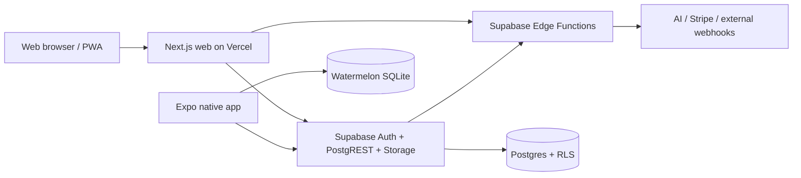

# E-Logbook: Production SaaS Transformation Plan

**Status:** proposed execution plan — no production feature is approved by this document alone.  
**Authoritative date:** 2026-07-13  
**Primary objective:** make the web application safe and easy to deploy quickly on Vercel + Supabase, then turn it into a credible enterprise SaaS without making claims the implementation cannot prove.

---

## 1. Operating decisions

1. **Safety and data integrity are release gates, not polish.** This product handles clinical and patient-related data. No feature that can expose, lose, duplicate, or silently corrupt that data ships because its UI is finished.
2. **Keep the deployment model simple.** The target remains one pnpm monorepo, one Vercel web project per environment, one Supabase project per environment, and EAS for mobile. Do not introduce Kubernetes, a separate microservice fleet, or a new database until measured demand requires it.
3. **Use one source of truth for each concern.** One migration history, one environment contract, one authorization contract, one API specification, one deployment workflow, and one design-token source.
4. **Ship the web product first.** Until local mobile encryption and sync correctness are proven, mobile must not be positioned as PHI-capable offline storage. It may remain an internal preview behind a feature flag.
5. **Remove or hide incomplete enterprise integrations.** A visible SSO, SCIM, webhook, payment, AI, or compliance feature is a product promise. If its contract is incomplete, turn it off rather than label it enterprise-ready.
6. **Treat the deployed database as potentially valuable.** Never rename or rewrite historical migrations against a live project without first reconciling its migration ledger, backing it up, and rehearsing the cutover in a clone.

### Non-negotiable release criteria

The first public production release must not happen until all items below are true.

- A clean checkout can install with `pnpm install --frozen-lockfile`, typecheck, lint, unit-test, build, and run database/RLS tests.
- A new staging Supabase project can be created from the committed migration set with no manual SQL.
- Preview, staging, and production use distinct Supabase projects and distinct secrets.
- Browser CSP does not block the app, and no authenticated page or API response carrying user data is cached by the service worker.
- All state-changing browser routes have authentication, tenant ownership/role authorization, schema validation, CSRF/origin protection, distributed rate limiting, audit coverage, and tests.
- Mobile encryption and sync have passed device-level recovery, conflict, idempotency, and cross-tenant tests before mobile is allowed to store PHI.
- SSO, SCIM, webhooks, AI, payments, and exports are either proven end-to-end or disabled in production.
- A restore drill, incident runbook, environment inventory, and production smoke test have been completed and signed off.

---

## 2. Evidence-based current-state assessment

This assessment was made from the source supplied in this workspace: 444 TypeScript/TSX/SQL files (about 49,118 source lines), 56 test files, 17 web route handlers, 28 authenticated/public web pages, 12 mobile screens, 76 SQL migration files, and 11 Edge Function directories. It is **not** an audit of the live Vercel project, live Supabase project, secrets, DNS, billing account, or GitHub history; those need the discovery tasks below.

### 2.1 What exists and is worth preserving

| Area | Current implementation | Preserve, but verify |
|---|---|---|
| Web | Next.js App Router in `apps/web`, tenant routes under `app/(authenticated)/[tenant]`, server-side Supabase client, route handlers, i18n (`en`, `ar`, `fr`), component tests and Playwright specs. | Tenant URL layout, server-first pages, shared components, test investment. |
| Mobile | Expo/React Native in `apps/mobile`, WatermelonDB models, biometric/screenshot helpers, device notification/linking helpers, retry logic and unit tests. | Native UX direction, device secure-store use, local-first intent; not the current persistence/security implementation. |
| Shared code | `packages/shared` contains Zod schemas, branded types, DB types, visual tokens and cross-platform components. | Shared validation/domain package, but make it the only public contract. |
| Database | Supabase/Postgres schema, tenant-scoped tables, RLS policies, functions, triggers, audit logs, retention/consent/approval/rotation/evaluation/milestone migrations. | Postgres + RLS approach, append-only/audited intent, database-side authorization tests. |
| Platform | Vercel config, Docker build paths, health endpoint, Sentry setup, Redis rate-limit fallback, GitHub Actions, SBOM/Semgrep/CodeQL/Trivy/ZAP workflows. | Managed deployment model and security tooling, after it is made executable and consistent. |

### 2.2 Actual runtime topology



The intended trust boundary is sensible: public clients use the anonymous key plus user JWT, Postgres RLS scopes tenant data, and `SUPABASE_SERVICE_ROLE_KEY` is used only after application authorization. That boundary is not consistently enforceable yet because service-role calls, metadata claims, database migrations, background work, and incomplete integrations are not governed by one tested contract.

### 2.3 Domain inventory

| Domain | Main source locations | Current state |
|---|---|---|
| Identity and tenancy | `apps/web/lib/supabase/{auth,server,middleware,admin}.ts`, `apps/web/proxy.ts`, `supabase/migrations/00001_*` through later RLS migrations | Tenant layout checks the route slug against the authenticated profile. Web and Edge Functions derive role/tenant differently; unify them. |
| Cases and approval | `CaseForm.tsx`, `case-form/*`, `app/(authenticated)/[tenant]/cases/*`, submit/approval routes, `case_entries`, `approval_requests` migrations | Richest vertical. Keep it as the first production slice. |
| Education | goals, rotations, duty-hours, milestones, evaluations, faculty evaluation components/pages and migrations `00069`–`00094` | Feature breadth is ahead of verification. Each module needs permission, data, and workflow acceptance tests. |
| Reporting/export | report pages, CSV/PDF/compliance/audit routes and `generate-pdf`, `webads-export` functions | Useful capability, but exports need a centralized authorization/audit/retention model. |
| Enterprise admin | SSO, SCIM, webhooks, AI config, payment config, retention admin | UI and schema exist; several server workflows are incomplete or unsafe to market. |
| Billing | plans/subscriptions/payments migrations; Stripe checkout/webhook functions | Stripe is partially wired. Paddle/LemonSqueezy claims are not equivalent to working implementations. |
| Offline/PWA | `public/sw.js`, `apps/mobile/lib/{sync,db}` | The web service worker and native sync must be redesigned before claiming offline PHI safety. |

### 2.4 Brutally honest blockers and material gaps

The following findings are based directly on the checked-in source. They are ordered by impact, not by ease.

| ID | Severity | Evidence | Why it matters | Required disposition |
|---|---|---|---|---|
| B-01 | Blocker | `supabase/migrations` contains both `00064_onboarding_flag.sql` and `00064_scim_tokens.sql`, plus both `00067_audit_gaps.sql` and `00067_template_favorites.sql`. | A clean migration rebuild cannot have an unambiguous ledger. Production schema state cannot be inferred from source alone. | Freeze schema deploys; reconcile against the remote migration history; baseline safely. |
| B-02 | Blocker | `apps/web/proxy.ts` puts the nonce only on the response. `app/layout.tsx` reads request headers. `next.config.mjs` and `vercel.json` also set different CSP/header policies. | The rendered app does not receive the nonce that the CSP requires, and multiple CSPs conflict. Production JavaScript can be blocked or protected less strictly than intended. | Establish one CSP source, forward nonce on the request, then test in a real production-mode browser. |
| B-03 | Blocker | `apps/mobile/lib/db/database.ts` explicitly says the stock adapter does not use SQLCipher; production EAS config sets `EXPO_PUBLIC_ENABLE_SQLCIPHER=true`. | The product claims encrypted local PHI but local Watermelon SQLite is not encrypted. | Do not ship/store PHI offline until real encryption is proven on physical iOS and Android devices. |
| B-04 | Blocker | `apps/mobile/lib/sync.ts` upserts rows with `onConflict: 'id'` while the new-draft payload omits `id`; it maps server ids by response order. Conflict handling queries `entry.id` instead of the stored `serverId`. | Retried mobile creates are not idempotent and may duplicate clinical records; conflict recovery can target the wrong id. | Replace with an explicit mutation/outbox protocol and device-generated canonical ids. |
| B-05 | Blocker | Watermelon schema is version 4 but `apps/mobile/lib/db/migrations.ts` supplies only a migration to version 3. | Existing mobile databases cannot reliably migrate to the declared schema. | Add and test every missing migration before any app update. |
| B-06 | High | `supabase/functions/sso-callback/index.ts` states full SAML/OIDC validation/token exchange is out of scope and redirects to metadata/discovery URLs. | SSO is not a real authentication protocol implementation. | Hide/disable SSO until a standards-compliant implementation passes IdP tests. |
| B-07 | High | `dispatch-webhook` and `apps/web/lib/webhooks.ts` read `tenant_webhooks.secret`; migration `00074_tenant_webhooks_encrypt.sql` stores the real value in `secret_enc` and writes `secret = 'encrypted'`. | HMAC delivery signatures are wrong after encryption; delivery can expose payloads and lacks a durable worker/dead-letter contract. | Disable customer webhooks; implement secure decryption and durable delivery/retry/replay. |
| B-08 | High | `public/sw.js` network-first caches all successful navigations, including authenticated tenant pages. | PHI-bearing HTML can persist in Cache Storage across logout or a shared device user. | Immediately unregister/update the worker to cache public shell assets only. |
| B-09 | High | `ai-quality` fetches raw `field_values` and accepts an arbitrary `custom` provider endpoint; AI integrations send data to external providers. | Possible PHI egress and SSRF/exfiltration without legal/vendor, consent, allowlist, redaction, or data retention controls. | Default AI off; permit only approved providers/models and de-identified payloads after a separate AI governance review. |
| B-10 | High | App docs claim SQLCipher, certificate pinning, compliance artifacts, and a canonical plan that do not exist or do not match code. `docs/offline-sync.md` names obsolete paths/behavior. | Compliance/security claims create legal and sales risk when they cannot be demonstrated. | Correct documentation before any enterprise marketing or contract representation. |
| B-11 | High | The web health route probes nonexistent `functions/v1/_health`; `vercel.json` schedules nonexistent `/api/cron/daily-builder`; logger posts to nonexistent `/api/log`. | Monitoring, scheduled work, and browser log delivery give false confidence or fail silently. | Build the endpoints/workers or remove the configuration. |
| B-12 | High | `app.json` has a placeholder EAS project id and references app icon/splash asset paths absent from the supplied asset tree. | A release build is not reproducible as checked in. | Configure real EAS project/build credentials outside source and add committed non-secret assets. |
| B-13 | High | GitHub workflows mix `main` and `master`, Node 20/22, and `pnpm/action-setup` with `pnpm/actions/setup`. Edge-function deployment omits several function directories. | CI/CD behavior and deployed function set are not deterministic. | Consolidate branch, runtime, action versions, deploy manifest, and release gates. |
| B-14 | Medium | `packages/env` says it fails fast but returns `result.data` after a failed parse; it is not the app's enforced configuration boundary. | Missing/invalid environment variables can fail later and less safely. | Replace with explicit server/public/mobile schemas that fail at startup. |
| B-15 | Medium | Service-role access occurs in many route handlers; SCIM state-changing web routes do not use their own CSRF/rate checks; `csp-violation` is unauthenticated and unbounded. | Security depends on repeated hand-written checks rather than a mandatory route boundary. | Create tested authorization and route wrappers; harden public telemetry endpoints. |
| B-16 | Medium | Root docs reference absent `.env.example`, `docs/env-reference.md`, `docs/compliance/`, and this plan; URLs vary across `.app`, `.dev`, and `.example`. | Onboarding, preview configuration, customer trust, and incident response are unreliable. | Create an environment inventory and documentation generated from it. |
| B-17 | Medium | Root `pnpm test` and `pnpm typecheck` could not run in this checkout because dependencies were absent; a lockfile install timed out after two minutes and left no usable `tsc` shim. | There is no demonstrated green baseline in the supplied workspace. | Complete installation in CI/local, record results, and repair every failing gate before feature work. |

### 2.5 Important claims that must not be made yet

Do not describe the product as HIPAA compliant, GDPR compliant, SQLCipher-encrypted, certificate-pinned, SAML/OIDC SSO-ready, complete SCIM 2.0, fully offline-first, enterprise webhook-ready, multi-provider billing, or production-ready AI until the corresponding acceptance criteria in this plan are complete and independently reviewed. Technical controls help compliance; they are not compliance certification.

---

## 3. Delivery model

### 3.1 Environments and branches

| Environment | Purpose | Data | Deployment rule |
|---|---|---|---|
| Local | Developer iteration | Synthetic seed data only | `supabase start` + local web/mobile. Never import production PHI. |
| Preview | PR visual/integration verification | Isolated synthetic staging data | One ephemeral or shared non-production Supabase branch/project. Never fall back to production secrets. |
| Staging | Release candidate, migration/restore/load rehearsal | De-identified production-like fixture data | Manual promotion from protected integration branch; release checklist required. |
| Production | Customer service | Production data | Protected production branch, approved migration plan, automated checks, manual environment approval. |

Choose **one** production branch (`main` is recommended because Vercel, GitHub, and the current web workflow already support it) and update every workflow, CONTRIBUTING document, protection rule, and Vercel setting to match. Do not support both `main` and `master` after the cleanup PR.

### 3.2 Definition of Done for every implementation task

Every task ticket/PR must include all applicable items:

1. A narrow problem statement and acceptance criteria copied from this plan.
2. A list of files and database objects expected to change.
3. Input validation through a shared Zod schema or a database RPC with explicit parameter types.
4. Authorization at the server boundary and RLS proof for data access.
5. Unit tests plus route/database/device tests appropriate to the change.
6. No PHI, secrets, auth tokens, raw webhook bodies, or unbounded user input in browser logs, server logs, analytics, errors, or test fixtures.
7. Migration forward path, backfill behavior, performance/index review, rollback/compensation plan, and audit event if persistent data changes.
8. A user-visible success/error/empty/loading state, keyboard behavior, mobile layout, and translations for supported locales.
9. Exact verification commands and evidence attached to the PR.

### 3.3 Required PR sequence

Do not mix database reconciliation, CSP repair, mobile storage rewrite, and feature work in one branch. Use small PRs in dependency order:

1. repository/configuration truth;
2. reproducible CI and test baseline;
3. database migration recovery;
4. web release blockers;
5. authorization/security boundary;
6. durable integrations and background jobs;
7. mobile data safety;
8. product expansion.

---

## 4. Phase 0 — establish a shippable web baseline

**Outcome:** a safe web-only production release path with a reproducible database, protected deployment pipeline, and no false enterprise promises.

### P0.1 — Recover repository authority and deployment inventory

**Owner:** platform lead. **Size:** S. **Depends on:** none.

1. Confirm the canonical GitHub repository URL, default branch, required checks, Vercel project id, Supabase project refs, EAS project id, and production domains with the owner.
2. The supplied workspace has no `.git` directory, so clone the canonical repository into a new working directory or initialize it from the verified remote before attempting a commit. Do not create a new unrelated Git history and push it over the existing project.
3. Record the current deployed Vercel commit/deployment id and Supabase migration ledger before any source or schema deployment.
4. Create a protected `main` branch policy: PR required, code-owner review for `supabase/**`, production environment approval, required CI/security checks, linear history, and no direct force push.
5. Add `docs/operations/environment-inventory.md` with names/owners of systems, not secret values. Store the actual secret-to-environment mapping in the password manager/secret manager.

**Verify:** `git remote -v`, `git branch --show-current`, GitHub branch protection screen, Vercel deployment details, and `supabase migration list --linked` are captured in the release record.  
**Do not:** commit `.env*`, Supabase access tokens, EAS credentials, database URLs, or a generated remote schema dump containing real data.

### P0.2 — Make installation, scripts, and configuration reproducible

**Owner:** platform + web. **Size:** M. **Depends on:** P0.1.

1. Add a tracked `.env.example` containing every variable name, scope (`public web`, `server web`, `mobile build`, `Edge Function`, `CI`), whether required, allowed environments, and safe example value. Never include a real key.
2. Add `docs/env-reference.md`; it is referenced by the README but absent. Generate/check it from a machine-readable environment manifest rather than maintaining two lists by hand.
3. Split configuration schemas:
   - `web-public`: only `NEXT_PUBLIC_*` values safe to embed;
   - `web-server`: service role, Sentry build token, Redis credentials;
   - `mobile-public`: Expo public URL/anon key/DSN only;
   - `functions`: Deno secrets;
   - `CI`: deployment credentials.
4. Replace the current partial-return behavior in `packages/env/src/index.ts` with explicit `parseOrThrow` functions. Import server config only from server-only modules; prevent `SUPABASE_SERVICE_ROLE_KEY` from entering a browser/mobile bundle.
5. Make root scripts deterministic: `check`, `typecheck`, `lint`, `test:unit`, `test:db`, `test:e2e`, `build:web`, `build:mobile:validate`, `security:scan`, and `release:verify`. A command may not silently skip a workspace.
6. Pin the Node version consistently to Node 22.x and pnpm 9.15.0 in `.nvmrc`, package metadata, Dockerfiles, EAS, and every GitHub workflow.

**Verify:** from a clean CI runner run `corepack enable`, `pnpm install --frozen-lockfile`, then every `pnpm check` subcommand. Run a build inspection proving service-role text is absent from client chunks.  
**Rollback:** configuration changes are code-only; revert the PR and restore prior Vercel variables if a required-name error is discovered.

### P0.3 — Repair the migration system without risking production data

**Owner:** database lead. **Size:** L. **Depends on:** P0.1. **Production freeze:** no `supabase db push` until this task is signed off.

1. In a read-only session, export the remote migration ledger and capture schema-only dumps for production and staging. Compare it with every local migration filename and checksum.
2. Determine which duplicate `00064`/`00067` files, if any, actually reached the remote database. Record database object dependencies, extensions, roles, grants, RLS policies, views, RPCs, triggers, cron jobs, storage policies, and seed/reference data.
3. Pick the safe route based on evidence:
   - **No customer/live data:** rebuild a clean local/staging database from a corrected, uniquely timestamped migration sequence; confirm the old project is disposable before reset.
   - **Any live data or unknown history:** do **not** rename historical files in place. Create a production clone/branch, derive one canonical schema baseline with timestamp-form migration ids, archive old source migrations outside the active migration directory with a manifest, replay/sanitize seed data, validate row counts/RLS, then plan a controlled cutover to the cloned project.
4. Create a migration linter that rejects duplicate versions, non-timestamp versions, destructive statements without an approved annotation, missing SQL regression tests, `SECURITY DEFINER` without a fixed `search_path`, unindexed tenant query paths, and policies without tenant predicates where applicable.
5. Generate `packages/shared/src/types/database.ts` from the canonical staging schema and add a CI diff check. Stop hand-editing generated database types.
6. Add a reversible test fixture seed with only synthetic accounts/data. Move demo credentials behind local-only configuration and verify they cannot be applied in preview or production.
7. Document forward-only migration policy: expand/backfill/dual-read/contract for zero-downtime changes; each destructive cleanup needs retention date and data-owner approval.

**Verify:** a blank Supabase project can run `supabase db reset`, all SQL regression tests, seed, and type generation twice with identical results. A clone test matches production row counts/checksums and passes tenant-isolation tests before DNS/environment cutover.  
**Rollback:** keep the original production project read-only-but-live until the clone passes smoke, export, restore, and rollback drills. Roll application environment variables back to the original project, never attempt ad-hoc reverse SQL under incident pressure.

### P0.4 — Make CI/CD a single trustworthy release pipeline

**Owner:** platform lead. **Size:** M. **Depends on:** P0.1–P0.3.

1. Consolidate `.github/workflows/{ci,cd,deploy-web,deploy-preview,deploy-mobile,security,semgrep,sbom,codeql,container-scan,dast}.yml` around the selected branch and Node/pnpm versions.
2. Replace inconsistent `pnpm/actions/setup` references with the verified action/version used everywhere else. Pin third-party actions by immutable commit SHA where the organization’s supply-chain policy requires it.
3. Make CI ordered and blocking: install → configuration check → typecheck → lint → unit/component tests → database reset/RLS tests → build → Playwright against preview → security scans. Upload reports even after failure.
4. Use a staging Supabase project for every preview. Remove the documented fallback that can point a preview at production credentials.
5. Replace ad-hoc Edge Function matrices with `supabase/functions/manifest.json` listing every deployable function, JWT mode, public/private status, required secrets, route owner, and tests. CI fails if a source function is absent from the manifest or deployment job.
6. Make database deployment an explicit production job after staging migration rehearsal and before code/function promotion only when changes are backward compatible. Require manual production environment approval.
7. Do not auto-submit mobile binaries from the same job that builds them. Build, device-test, approve, then submit from a separate release workflow.
8. Fix/remove `vercel.json` references to routes that do not exist; the current scheduled `/api/cron/daily-builder` must either be implemented with authenticated scheduling or deleted.

**Verify:** open a test PR that proves every required check runs; preview uses staging variables; a failing RLS test and a missing Edge Function manifest entry both block merge. Perform a controlled production rollback using Vercel promotion and the documented database compensation process.  
**Do not:** run production `db push --include-all` automatically for unreviewed migrations.

### P0.5 — Fix web delivery/security blockers

**Owner:** web security. **Size:** M. **Depends on:** P0.2.

1. Make `apps/web/proxy.ts` the sole dynamic CSP authority. Generate a cryptographically random nonce, inject it into the **forwarded request headers** used by Next rendering, and set the same nonce CSP on the response. Test the exact Next.js proxy API rather than assuming a response header is readable during render.
2. Remove duplicate/conflicting root CSP/header declarations from `apps/web/next.config.mjs` and `vercel.json`. Retain one coherent policy with explicit allowed origins. Do not retain `'unsafe-eval'` in production; reduce `'unsafe-inline'` after nonce-compatible style strategy is confirmed.
3. Apply nonce to every inline/JSON-LD/third-party script or remove it. Browser-test login, authenticated navigation, client hydration, PostHog/Sentry opt-in paths, service-worker registration, and a CSP report route with DevTools set to “treat CSP as blocking.”
4. Replace `public/sw.js` immediately with a public-shell-only worker: never cache routes below `/:tenant`, APIs, HTML containing authenticated content, user-specific images, exports, or Supabase responses. Version caches, clear legacy caches on activation, purge on sign-out, and add a one-time logout cleanup. If this cannot be proven quickly, unregister the worker in production.
5. Replace `/api/health` with public liveness (no internals, no auth query) and authenticated/allowlisted readiness diagnostics. Either add a real Edge health endpoint to the manifest or remove its check. Bound and rate-limit CSP reports; reject bodies larger than a small configured limit; never log raw headers/cookies.
6. Remove the browser logger’s nonexistent `/api/log` behavior or build a small authenticated, bounded, redacting intake route. Prefer server-side structured logs; browser telemetry must be opt-in and privacy reviewed.
7. Set Sentry Session Replay sampling to zero until DOM masking, data classification, contractual coverage, and a PHI test are complete. Treat analytics/PostHog as disabled by default for clinical views until its legal/technical controls are approved.

**Verify:** Playwright production-mode smoke suite has no CSP console errors, no blocked JS, no stale authenticated HTML after logout/login as a different test user, and no health response exposes upstream error text. Add automated header assertions for every route class.  
**Rollback:** header/service-worker changes are independently deployable. Keep a previous Vercel deployment ready to promote, but do not restore the unsafe service-worker cache behavior.

### P0.6 — Establish an API and authorization boundary

**Owner:** web + database security. **Size:** L. **Depends on:** P0.3, P0.5.

1. Define one `RequestActor` (`userId`, `profileId`, `tenantId`, `tenantSlug`, `role`, `aal`, request id) built from `getAuthContext`. Web routes must not independently invent identity lookups.
2. Create reusable server helpers for: `requireActor`, `requireTenantParam`, `requireRole`, `requireMfa`, `validateBody`, `validateOrigin`, `rateLimit`, `audit`, and safe error mapping. Keep transport helpers out of React components.
3. Inventory every route in `apps/web/app/api` and `app/(authenticated)/**/route.ts`; migrate one route family at a time. State-changing SCIM and any future browser mutation must receive CSRF/origin and per-actor rate controls in addition to proxy-wide IP limits.
4. For every service-role call, first authorize with the caller-scoped Supabase client, assert the tenant slug/id relationship, then use a narrow service function that receives an already-authorized tenant id. Make direct `createServiceRoleClient()` imports restricted by lint rule/code owner.
5. Put all HTTP input/output schemas in `packages/shared/src/schemas` and use them for route parsing, Edge Function parsing, OpenAPI generation, and UI form validation. Treat the client as untrusted even where a form already validates.
6. Correct authorization semantics in reporting/export routes: no hard-coded record cap that silently creates incomplete official reports; use pagination/job status or explicit “partial” responses. Ensure every tenant path check uses the canonical actor.
7. Add a route matrix to `docs/security/api-authorization-matrix.md`: endpoint, method, actor/role, tenant source, input schema, CSRF, rate limit, data classification, audit event, test file.

**Verify:** table-driven tests exercise unauthenticated, wrong-tenant, wrong-role, stale-MFA, malformed-body, missing-origin, rate-limited, and happy-path cases for every mutating route. An AST/lint test rejects a new route lacking the boundary helper.  
**Do not:** use UI navigation visibility as authorization; only server/RLS decisions count.

### P0.7 — Correct docs, product claims, and operational runbooks

**Owner:** product + platform. **Size:** S. **Depends on:** P0.2–P0.6.

1. Make this file the canonical plan referenced by `README.md`. Mark older `analysis/UPGRADE_PLAN.md` and related speculative analysis as historical, not authoritative.
2. Repair/remove every nonexistent document link and placeholder domain/email/project id. Pick the canonical public domain and make `README`, OpenAPI, sitemap, robots, app manifest, auth redirects, Edge CORS allowlist, mobile deep links, and deployment docs agree.
3. Replace `docs/offline-sync.md`, `SECURITY.md`, deployment, backup, and load-test claims with code-verified behavior only. Add a “not yet supported” section for mobile offline PHI, SSO/SCIM, AI, webhooks, and billing until released.
4. Add minimal operational runbooks: deploy, rollback, incident, access removal, backup/restore, migration, secret rotation, data export/deletion request, and customer-support escalation.
5. Add a release checklist with named owner sign-offs for technical, security/privacy, product, and operations.

**Verify:** link checker passes, a new developer can complete local setup from scratch, and an operator unfamiliar with the code can follow the staging deploy/rollback runbook.

---

## 5. Phase 1 — data security, reliability, and enterprise foundations

**Outcome:** the first web release has a defendable authorization/data contract; integrations that remain enabled are durable and observable.

### P1.1 — Rebuild database policy assurance

**Owner:** database security. **Size:** L. **Depends on:** P0.3, P0.6.

1. Publish a role model for `resident`, `supervisor`, `director`, `institution_admin`, and platform `admin`: allowed resources, actions, field visibility, approval authority, MFA requirement, and break-glass policy.
2. Select one tenant identity source for server/RLS/Edge Functions. Current web code resolves `profiles`, while shared Edge auth trusts `user.app_metadata`. Either synchronize claims transactionally with an auth hook and verify them or resolve profiles server-side for every privileged Edge request; document the choice.
3. Re-audit every table, view, materialized view, RPC, trigger, storage object, and `SECURITY DEFINER` function. Enforce RLS/`FORCE RLS`, explicit grants/revokes, fixed `search_path`, tenant predicates, and ownership semantics.
4. Prevent user-controlled audit inserts/updates/deletes. Audit trails need actor, tenant, action, resource, correlation id, timestamp, immutable before/after allowlist, and retention classification. Do not call a log append-only merely because the UI lacks delete.
5. Add executable cross-tenant negative tests for every core table and RPC, role escalation tests, soft-delete visibility tests, lapsed-subscription write guards, concurrent approval tests, and storage-object path tests. Run them in CI against a reset database.
6. Add query-plan tests/observability for tenant-scoped hot paths and verify indexes from real `EXPLAIN (ANALYZE, BUFFERS)` in staging.

**Verify:** a test user cannot access another tenant by changing URL, JWT metadata, RPC params, storage path, direct PostgREST request, view, or function call. A service-role test proves bypass is limited to designated server/worker code.

### P1.2 — Protect exports, attachments, and lifecycle data

**Owner:** web + privacy. **Size:** L. **Depends on:** P1.1.

1. Establish data classes: direct identifiers, quasi-identifiers, clinical record content, credentials, audit data, telemetry, and derived/AI data. Put the class on each table/field and export format.
2. Move PDF/CSV/WebADS/compliance/audit exports behind one export service with typed request, role/tenant validation, consent/retention check, audit event, rate limit, time/row limit, and deterministic CSV/XML escaping.
3. For large exports, create an asynchronous job table and worker. Store encrypted artifact metadata only; issue single-use, short-lived signed URLs; delete artifacts on expiry. Never stream unlimited records from a Vercel request.
4. Default WebADS and any direct-identifier export to disabled until a named customer contract, data-processing authorization, recipient mapping, and content review exist. A supervisor role alone is not enough to establish lawful disclosure.
5. Model attachment lifecycle explicitly: allowed MIME signatures (not only extension), 20 MB server enforcement, tenant/user path namespace, malware scanning/quarantine, signed upload/download URLs, no public bucket policies, retention deletion, and audit events.
6. Implement privacy operations as tested jobs: data subject export, correction annotation, retention hold, legal hold, deletion/anonymization, tenant offboarding, and access revocation. Do not promise immutable audit retention if law requires erasure; retain a minimal irreversible event where lawful.

**Verify:** test exports with unauthorized/cross-tenant/expired-consent/high-volume inputs; prove generated files have no formula injection and storage links expire. Run an attachment EICAR/quarantine test in staging.

### P1.3 — Make webhooks a durable, safe integration service

**Owner:** integrations. **Size:** L. **Depends on:** P0.3, P1.1.

1. Keep outbound webhooks disabled until delivery is reimplemented. Do not use plaintext `tenant_webhooks.secret` after `secret_enc` is introduced.
2. Add a server-side secret-access RPC/function that decrypts only inside a trusted worker, never returns secrets to the browser or normal PostgREST clients, and records key version/rotation state.
3. Replace inline delivery from request handlers and Postgres triggers with an outbox table written in the same transaction as the domain event. A worker claims rows with `FOR UPDATE SKIP LOCKED`, sends with connection/read timeouts, signs canonical JSON plus timestamp/id, stores a redacted delivery record, and uses exponential retry with jitter.
4. Validate webhook URLs at create/update: HTTPS only; resolve DNS before delivery; block private/link-local/loopback/reserved IPs after DNS resolution and after redirects; limit redirects/body sizes; deny credential-bearing URLs; maintain a response allowlist.
5. Provide event ids, idempotency guidance, versioned payload schemas, delivery attempt history, replay for authorized admins, dead-letter queue, pause/disable controls, and key rotation.
6. Deploy the worker/function via the Edge Function manifest and add failure/retry/replay/SSRF tests.

**Verify:** a staging receiver validates HMAC, receives a duplicate safely, sees retries after 5xx/timeouts, and cannot make the worker fetch a private address. A key rotation keeps old deliveries verifiable only for the documented grace period.

### P1.4 — Implement enterprise identity honestly

**Owner:** identity. **Size:** XL. **Depends on:** P1.1.

1. Until this is complete, remove/hide SSO and SCIM entry points from production admin UI and login flows. Return an explicit disabled response; do not redirect users to discovery/metadata endpoints.
2. Decide whether to use Supabase-supported enterprise SSO or a dedicated identity broker. The choice must support OIDC authorization-code flow with PKCE/state/nonce, issuer/audience/signature validation, JWK rotation, redirect allowlists, tenant discovery, session binding, account linking, logout, and audit events. SAML must validate signed assertions, issuer/audience/destination, time bounds, replay id, certificate rotation, and NameID mapping.
3. Store client secrets/certificates only with an approved KMS/secret mechanism. Add secure configuration validation; never use a merely named `_encrypted` text column as proof of encryption.
4. Define JIT provisioning policy, domain verification, role mapping constraints, MFA/step-up requirements, suspension/deprovisioning behavior, and support recovery paths.
5. Choose a SCIM scope. Either implement RFC 7644 essentials (service config, users, pagination, filtering, PATCH semantics, ETags, group support if advertised, deprovisioning) and test with target IdPs, or label it a limited provisioning API and do not call it SCIM 2.0.
6. Use scoped, hashed, rotatable SCIM bearer tokens with last-used telemetry, rate limits, tenant binding, request idempotency, IP restrictions if required, and immutable provisioning audit events.

**Verify:** integration test suites pass against at least the identity providers customers will use; replay/state/issuer/redirect attacks fail; a disabled user loses API/session access promptly; SCIM conformance tests match the advertised scope.

### P1.5 — Make billing a single-provider, auditable release first

**Owner:** billing. **Size:** L. **Depends on:** P0.6, P1.1.

1. Release only Stripe until Paddle and LemonSqueezy each have equivalent checkout, webhook, cancellation, tax, invoice, refund, idempotency, and support flows. Update product copy accordingly.
2. Make Stripe configuration tenant/account mapping explicit. The present `readTenantSlug` placeholder must not be relied on for Connect routing.
3. Model immutable provider events and separate them from derived subscription state. Validate signatures against the intended account/mode, deduplicate under a unique provider event id, process asynchronously, retry safely, reconcile with provider API, and alert on failures/stuck events.
4. Make entitlement checks server-side and fail closed only after an intentional grace-period policy. Web UI banners do not enforce billing access.
5. Add finance/admin tooling for plan change, trial, past due, cancellation, refund, invoice link, tax/customer ids, and support audit trail.

**Verify:** Stripe test clocks cover checkout, duplicate events, out-of-order events, payment failure/recovery, cancellation, refund, and wrong-mode/wrong-account signatures. A full reconciliation report has zero unexplained differences in staging.

### P1.6 — Govern AI before enabling it

**Owner:** AI + privacy/security. **Size:** L. **Depends on:** P1.1–P1.2.

1. Default all AI features off at tenant and system level. Enable only for an approved provider/model, an approved purpose, a documented data-processing agreement/BAA where needed, tenant opt-in, and an authorized role.
2. Define data-minimization transformations before the provider call. Do not send MRN, DOB, names, free-text field values, attachments, or identifying context unless an explicit, reviewed use case permits it. Prefer structured de-identified values and local deterministic checks for completeness.
3. Remove arbitrary custom URLs. Allow only an approved HTTPS provider registry with egress controls, domain allowlists, IP/DNS anti-SSRF checks, model allowlist, timeout/token/cost caps, and no provider key in browser code.
4. Add prompt/version registry, output schema validation, safety filters, clinician-facing disclaimer, no autonomous clinical decisioning, feedback/appeal flow, retention/deletion policy, and per-tenant spend/quota metering.
5. Store only redacted telemetry necessary for support. AI output needs provenance: model, prompt version, input data class, timestamp, human acceptance/rejection, and source record reference.
6. Build adversarial tests for prompt injection in case fields, PII leakage, malformed provider output, timeouts, quota races, unavailable provider, and cross-tenant cache access.

**Verify:** a recorded de-identified fixture produces schema-valid output; static/DLP tests prove disallowed fields cannot reach a provider adapter; all disabled/over-quota paths return safe errors without billing or audit gaps.

---

## 6. Phase 2 — mobile safety and true offline workflow

**Outcome:** mobile is either a tested clinical companion or explicitly not a PHI storage client. This phase is intentionally after the web baseline.

### P2.1 — Deliver actual encrypted local storage

**Owner:** mobile security. **Size:** XL. **Depends on:** P0.2, P1.1.

1. Choose a Watermelon-compatible encrypted database approach that is maintained for the Expo/React Native versions in use and supports both iOS and Android release builds. Document the threat model: device theft, rooted/jailbroken device, backup extraction, process memory, and keychain compromise.
2. Implement native SQLCipher/approved encrypted adapter integration. The existing `getOrCreateDbEncryptionKey()` must be used by the adapter; setting a public EAS flag or changing a database name is not encryption.
3. Generate 256-bit keys with OS CSPRNG, retain them only in Keychain/Keystore with the strongest available access control, handle reinstall/key-loss recovery, and define data wipe behavior. Do not invent key recovery that makes a lost device’s data decryptable from the server.
4. Complete the Watermelon schema migration chain through version 4 and future versions. Test upgrade from each supported previous app version, downgrade handling, corrupted DB recovery, low-storage behavior, and encryption key unavailable behavior.
5. Make biometric lock a user-experience layer, not the encryption key itself. Enforce relock after a configurable background interval, wipe sensitive in-memory state on backgrounding, prevent screenshots on supported sensitive screens, and document platform limitations.
6. Add release-build evidence: `PRAGMA cipher_version`/equivalent proof, inspect a pulled device database to show plaintext records are absent, and run physical-device automated/manual tests on iOS and Android.

**Verify:** a test case cannot be read from a copied app database without the device key; a fresh install/reinstall behaves according to the documented wipe policy; every migration path opens successfully.  
**Release gate:** no mobile PHI feature, TestFlight/Play release, or security claim before this test evidence is attached.

### P2.2 — Replace ad-hoc sync with a versioned mutation protocol

**Owner:** mobile + database. **Size:** XL. **Depends on:** P2.1, P1.1.

1. Write a sync protocol specification before coding: record ids, operation ids, cursor format, server version, conflict states, tombstones, retry semantics, retention window, tenant changes, offline logout, and user-visible resolution behavior.
2. Assign a UUID at local case creation and use that same canonical UUID as the server primary key. Eliminate response-order matching and the ambiguous local-id/server-id split after a migration/backfill plan is in place.
3. Add a durable local outbox with immutable operation id, entity type/id, tenant id, mutation type, base version, payload hash, created time, retry state, and last error. A mutation must be safe to submit repeatedly.
4. Replace direct table upserts with a transactionally validated server sync RPC/API. It must authenticate the actor, verify tenant/ownership/RLS, apply idempotency, enforce allowed state transitions, return per-mutation acceptance/conflict/rejection, write audit events, and not partially acknowledge a batch without a recovery token.
5. Replace timestamp-only pulls with a monotonic server change sequence or stable `(updated_at, id)` cursor. Include soft deletes/tombstones. Never prune an unsynced record; make the 500-record local cache policy explicit and user-configurable/observable.
6. Define conflicts by field/domain. For clinical entries, do not silently use last-write-wins for submitted/approved records; show a human resolution flow with server/local snapshots and audit the decision. Drafts may use a documented deterministic merge.
7. Decide which entities are genuinely mobile-editable. Current code pulls cases/templates/goals/rotations/milestones/evaluations/comments but only pushes cases. Either implement end-to-end mutation support per entity or make the others read-only in the UI.
8. Build a device + server test harness for network loss, offline create/edit/delete, retry after app kill, duplicate delivery, token expiry, tenant switch, two-device concurrent edits, clock skew, 10k records, and malicious cross-tenant payloads.

**Verify:** each test scenario has deterministic expected server/local state; repeated sync cannot create a duplicate case; an approved record cannot be silently overwritten; all failed operations remain visible and recoverable to the user.

### P2.3 — Make mobile builds and release operations real

**Owner:** mobile + platform. **Size:** M. **Depends on:** P2.1–P2.2.

1. Replace placeholder `app.json` EAS project id and add the referenced icon/splash/adaptive-icon assets or correct their paths. Keep credentials out of the repository.
2. Move mobile runtime config to EAS secrets/remote environment profiles and validate it at build/startup. A release build must fail early rather than crash because `supabaseUrl`/anon key are blank.
3. Define OTA update compatibility around the encrypted database schema/runtime version. Database migrations must be shipped in a native build before an OTA update relies on them.
4. Add signed Android/iOS artifact checks, dependency vulnerability scan, privacy manifest/permission review, device smoke tests, deep-link tests, push notification tests, and staged rollout/crash threshold policy.
5. Add customer-support runbooks for lost device, forced sign-out, remote token revocation, app data wipe, and sync failure export.

**Verify:** EAS preview and production builds complete from a clean CI worker; installed builds pass login, biometric gate, encrypted DB, offline queue, reconnect, logout/wipe, and deep-link smoke tests.

---

## 7. Phase 3 — product, UX, and enterprise operations

**Outcome:** polished core workflows with scale/operations that support paid programs. Do not start broad market expansion until Phases 0–2 are green.

### P3.1 — Make the case workflow the flagship experience

**Owner:** product design + web/mobile. **Size:** L. **Depends on:** P0.6, P1.2.

1. Define measurable role journeys: resident logs a case; supervisor reviews/returns/approves; director detects missing experience; institution admin onboards program/users; platform admin supports tenant safely.
2. Set measurable UX targets: resident draft in under 60 seconds on a phone, validation errors adjacent to fields and announced to screen readers, autosave status clear, no destructive action without impact confirmation, and no inaccessible color-only status.
3. Keep `packages/shared/src/constants/design-tokens.ts` as the token source. Establish component contracts (inputs, selection, dialogs, table/pagination, status badge, empty/error/skeleton, responsive shell) and remove one-off divergent styles only when touching the affected component.
4. Make form definitions versioned. A template change must not reinterpret existing case data; store template version/snapshot with the entry and give admins migration/retirement controls.
5. Add server-side validation for template field values, cases, approvals, duty periods, evaluations, rotations, and attachments using shared schemas. Client validation improves UX; it is not authoritative.
6. Audit all keyboard shortcuts, focus traps, dialog escape/cancel, touch targets, RTL layouts, date/time zone rendering, Arabic/French translation coverage, high contrast, and screen-reader labels. Replace hard-coded clinical strings with `next-intl` messages.

**Verify:** moderated role walkthroughs plus Playwright accessibility checks cover create, edit, submit, reject/resubmit, approve, export request, and error recovery on desktop/mobile/RTL. Track time-to-complete and validation abandonment before/after.

### P3.2 — Complete educational workflows deliberately

**Owner:** product + clinical domain reviewer. **Size:** XL. **Depends on:** P1.1, P3.1.

Implement in this order; each line is a separate epic with clinical-owner sign-off, data model, RLS, migration, validation, audit events, exports, and tests.

1. **Rotations and duty hours:** schedule/assignment lifecycle, timezone/DST safe shifts, overlap/rest-rule checks, supervisor attestation, exception workflow, reporting period lock, and non-repudiation.
2. **Evaluations:** versioned Mini-CEX/DOPS/CBD and faculty forms, invitations, evaluator anonymity policy, save/submit/lock lifecycle, correction/addendum, calibration reporting, resident visibility timing, and export.
3. **Milestones/frameworks:** framework version catalog, tenant adoption, competency/subcompetency/evidence mapping, assessor authority, historical version preservation, and committee-ready reports. Do not claim ACGME/SCFHS/GMC/CanMEDS compatibility without licensed/current source material and subject-matter review.
4. **Goals/analytics:** clear metric definitions, cohort/date/role filters, privacy thresholds for aggregate charts, drill-down permissions, materialized-view refresh strategy, and export disclaimers.
5. **Onboarding/admin:** institution/tenant creation, invite lifecycle, role change approval, deactivation, specialty/program setup, template library, import validation/error report, and support impersonation only through audited time-bound break-glass controls.

**Verify:** each workflow has acceptance tests for every role and negative tenant/role case, plus domain-review test data and an explicit data-retention/export behavior.

### P3.3 — Performance and capacity engineering

**Owner:** platform + database. **Size:** L. **Depends on:** P0.3, P1.1.

1. Set SLOs before optimization: web availability, authenticated page P95, write P95, export completion, sync success, mobile crash-free sessions, and background queue age. Start conservative and revise with real traffic.
2. Instrument request id, actor/tenant (pseudonymous in telemetry), route, status, duration, database query count/duration, Edge Function invocation, queue age, cache result, and error class. Do not emit PHI.
3. Profile the dashboard, cases, approvals, reports, audit, and exports with production-like synthetic data. Use `EXPLAIN (ANALYZE, BUFFERS)`, Supabase query stats, Vercel functions telemetry, and browser Web Vitals before adding indexes/caches.
4. Use cursor/keyset pagination for tenant-scoped tables; never rely on unbounded select plus a UI cap. Maintain composite indexes matching actual tenant filters/sorts; add partial indexes for active/non-deleted data where measurements justify them.
5. Move long PDF/export/webhook/billing/reconciliation work out of request lifecycles into durable jobs. Keep Vercel handlers short, idempotent, and timeout-aware.
6. Make Redis rate limits fail according to policy: privileged/state-changing operations should fail closed or use a database atomic limiter; a per-instance in-memory fallback is not sufficient for abuse protection. Hash/pseudonymize keys and set retention.
7. Replace the current load-test document/targets with implemented endpoints and authenticated fixtures. Run smoke on preview, controlled load in staging, and capacity tests only with explicit approval.

**Verify:** published dashboard of SLOs, load-test reports, query-plan evidence, and alert thresholds. A release must not degrade a protected P95/error budget beyond the agreed threshold.

### P3.4 — Observability, backup, and incident readiness

**Owner:** operations. **Size:** M. **Depends on:** P0.4–P0.5, P1.2.

1. Define alert ownership and escalation for availability, auth errors, RLS denials, queue backlog, Stripe webhook failures, failed backups, migration drift, error-rate spike, storage quota, AI quota, and suspicious exports.
2. Standardize structured logging with a redaction test suite. Replace raw `console.*` in application code where practical; do not log request bodies, tokens, encrypted data, or `field_values`.
3. Configure Sentry with verified source maps, release/version tags, privacy filtering, sample rates appropriate to PHI, and an incident workflow. Test a synthetic error end-to-end and inspect the event manually for sensitive data.
4. Turn backup documentation into an operated control: automated encrypted backups/PITR policy, off-site storage, access restrictions, integrity checks, backup success alert, restore runbook, and quarterly restore drill. The current local shell script/documentation is not evidence that managed Vercel/Supabase production backups run.
5. Create incident templates for security event, data corruption, failed deployment, availability, vendor outage, mistaken export, and mobile sync duplication. Include customer communication, evidence preservation, forensic access, postmortem, and preventive action.

**Verify:** restore production-like staging data to a new project within agreed RPO/RTO; run a tabletop incident; prove alerts reach a named responder and do not contain PHI.

---

## 8. Testing strategy and required commands

### 8.1 Test layers

| Layer | Required coverage | Primary tools |
|---|---|---|
| Static | formatting/lint, TypeScript, dependency/license/security policy, secret scan, config schema | ESLint, `tsc`, Semgrep, CodeQL, lockfile audit, custom scripts |
| Shared domain | Zod schemas, branded ids, sorting, feature/domain invariants | Vitest |
| Web unit/component | route boundary helpers, auth/CSRF/rate limit/error states, form behavior, accessibility | Vitest + Testing Library |
| Database | migrations from blank DB, RLS/role/tenant isolation, RPCs/triggers, indexes/query plans, storage policy | Supabase CLI/Postgres SQL tests |
| Edge Functions | auth, schema, CORS, egress, idempotency, provider error handling | Deno tests + integration fixture |
| Browser E2E | login/MFA, tenant isolation, case lifecycle, exports, responsive/RTL/keyboard/CSP/service-worker behavior | Playwright against preview/staging |
| Mobile | local DB migration/encryption, sync protocol, auth/biometric/permissions, native flows | Vitest plus Detox/Maestro/device farm |
| Non-functional | load, backup restore, failure/retry, deploy rollback, security scan | k6, staging drill, ZAP, Trivy |

### 8.2 Mandatory quality gates

The exact command names may change during P0.2; CI must execute the following logical gates and fail rather than warn on protected branches.

```text
pnpm install --frozen-lockfile
pnpm check:env
pnpm typecheck
pnpm lint:all
pnpm test:unit
supabase db reset
pnpm test:db
pnpm build:web
pnpm test:e2e
pnpm security:scan
```

For a database or Edge Function PR, add the relevant SQL/Deno test. For a mobile storage/sync PR, add migration/encryption/device evidence. For a production release, run the staging smoke, backup restore check, migration rehearsal, and rollback drill in the release checklist.

### 8.3 Test data rules

- Use only generated/synthetic patient and clinician data outside production.
- Add test factories that generate realistic but unmistakably fake MRNs, dates, names, case fields, tenant ids, and provider payloads.
- Do not put real PHI, credentials, webhook secrets, Stripe payloads containing customer data, or copied production records into commits, snapshots, Sentry fixtures, browser traces, or logs.
- Use separate tenants/roles in every integration test and make cross-tenant denial an explicit assertion.

---

## 9. Security control backlog

This is the required control checklist, not a statement that the controls are currently satisfied.

| Control | Implementation requirement | Evidence |
|---|---|---|
| Identity | Authenticated actor resolved once; MFA/step-up for privileged actions; session revocation and device/logout flows | route/E2E tests, auth logs |
| Authorization | Server role/tenant checks plus RLS for every table/view/RPC/storage object | matrix + SQL negative tests |
| Secrets | Vercel/Supabase/EAS secret stores; scoped access; rotation inventory; no client exposure | secret scan + rotation drill |
| Cryptography | Managed platform encryption plus real mobile local encryption; documented key lifecycle | device extraction test, KMS/key docs |
| Network/egress | CSP, SSRF controls, outbound provider allowlists, webhook URL validation, CORS allowlists | browser/egress tests |
| Input/output | Zod/RPC validation, CSV/XML/PDF safety, upload MIME scanning, response size limits | fuzz/property/route tests |
| Abuse protection | Distributed rate limits, auth throttling, quotas, WAF/Vercel firewall policy, queue limits | load and 429 tests |
| Audit | Immutable, redacted, queryable actor/resource/action events; export and support access included | audit verification tests |
| Privacy | Data inventory, retention/deletion/legal hold, consent, processor register, DPA/BAA review | policy + job tests |
| Supply chain | locked dependencies, SBOM, vulnerability SLA, action pinning, review/branch protection | CI artifacts |
| Recovery | backup/PITR, restore RTO/RPO drill, migration/rollback plan, incident owner | quarterly drill record |
| Monitoring | PHI-safe logs/traces/errors, SLO alerts, security events, change/deployment correlation | alert test + dashboard |

---

## 10. Priority sequence and stop/go gates

| Order | Deliverable | Go/no-go condition |
|---|---|---|
| 0 | P0.1 repository/deployment inventory | Canonical repository and real deployment state are known. |
| 1 | P0.2 reproducible install/config | Fresh CI checkout is green or every baseline failure is a ticket with owner. |
| 2 | P0.3 migration reconciliation | Clean schema build and staging clone evidence exist; otherwise stop all schema feature work. |
| 3 | P0.4 CI/CD + P0.5 CSP/service-worker | PR preview and production-mode browser tests are trustworthy; authenticated cache is eliminated. |
| 4 | P0.6 API boundary + P0.7 truthful docs | Web core may enter limited pilot only after route matrix/RLS/export review. |
| 5 | P1.1–P1.6 enterprise foundations | Enable one integration at a time only after its dedicated verification. |
| 6 | P2 mobile security/sync | Mobile PHI pilot only after physical-device encryption and duplicate/conflict tests. |
| 7 | P3 product scale/operations | Expand modules/markets only after SLO/backup/incident controls operate in staging and production. |

### Suggested first limited pilot scope

To reach production quickly without pretending the whole backlog is complete, the first pilot should be web-only and limited to: invite-only tenant onboarding, resident case entry, supervisor approval/rejection, director dashboard, audit log, and a reviewed non-PHI report. Disable public signup, mobile PHI/offline mode, SSO, SCIM, outbound webhooks, third-party AI, direct WebADS export, and non-Stripe billing claims until their phases complete.

---

## 11. Work-item template for implementation agents

Copy this template into every ticket/PR. An agent must not start a later dependent task merely because the UI is visible.

```markdown
## ID and goal
P?.? — <one measurable outcome>

## Preconditions
- [ ] Required preceding plan items are complete.
- [ ] Working tree is clean and canonical branch is known.
- [ ] Relevant environment is staging/synthetic, not production.

## Scope
- Files/components/database objects allowed to change:
- Explicit non-goals:
- Data classification affected:

## Implementation steps
1. Add/modify shared schema and types first.
2. Add a failing unit/route/SQL/device test that demonstrates the gap.
3. Implement the smallest server/database change that satisfies the contract.
4. Implement UI only after the boundary is tested.
5. Add telemetry/audit/migration/rollback behavior as required.

## Security and data checks
- [ ] Authentication and tenant/role authorization
- [ ] RLS and service-role review
- [ ] Input/output validation and size limits
- [ ] CSRF/rate limit/idempotency where state changes
- [ ] No PHI/secrets in telemetry or fixture
- [ ] Retention/export/audit effect documented

## Verification
Commands:
Expected evidence:
Manual staging scenario:
Rollback/compensation:

## Definition of done
- [ ] Tests and build green
- [ ] Accessibility/i18n/loading/error states complete
- [ ] Docs/OpenAPI/runbook updated
- [ ] Reviewer verifies every acceptance criterion
```

---

## 12. Immediate next implementation slice

Start with the following small, safe PRs in order. No new feature screens are needed for these PRs.

1. **`chore: establish canonical repo and environment contract`** — P0.1/P0.2 documentation, `.env.example`, config parser tests, no deployment behavior change.
2. **`ci: make quality gates reproducible`** — normalize Node/pnpm/action usage and have CI prove install/typecheck/lint/test/build; do not deploy.
3. **`db: reconcile migration ledger in staging`** — inventory/clone/baseline work only; do not touch production schema until rehearsal evidence is reviewed.
4. **`security: repair CSP nonce and disable authenticated PWA caching`** — focused web deployment with Playwright console/cache tests.
5. **`security: introduce route actor/boundary helpers`** — migrate one mutating route family (case submit/approval) with complete negative tests, then repeat.
6. **`docs: correct production capability and operations claims`** — align README, security, deployment, offline, OpenAPI, domains, and disable incomplete UI entries.

Only after these six PRs are green should the team choose whether the next investment is web pilot onboarding, outbound webhooks, Stripe hardening, or mobile encryption/sync.

