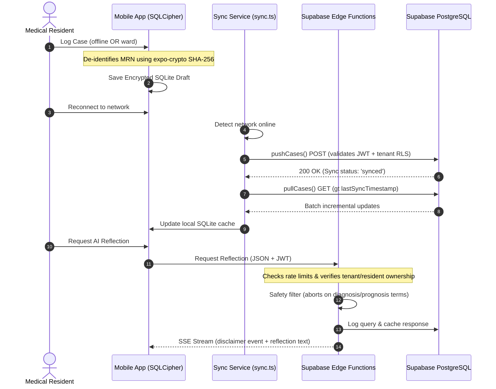

# E-Logbook Enterprise: Brutal Code Audit & Integration Action Plan

This document provides a line-by-line, code-by-code architectural analysis of the `elogbook` monorepo and a detailed plan to transition the system to an enterprise-grade, HIPAA/GDPR/SCFHS-compliant clinical SaaS.

---

## 1. EXECUTIVE SUMMARY: BRUTAL HONESTY

The `elogbook` codebase has a visually polished design system and modern directory structure, but **it is not enterprise-ready and must not process real patient data in its current state**. Multiple critical security vulnerabilities, compile-breaking bugs, and dead integrations exist across all layers.

### Key Showstoppers:
1. **Broken Mobile Case Logging (S1):** Reference compile breaks in [apps/mobile/app/(tabs)/log-case.tsx](file:///g:/elogbook/apps/mobile/app/(tabs)/log-case.tsx) mean the core resident user flow fails to build.
2. **Dead Sync Engine (S2):** The `syncService.setTenantId(tenantId)` function is never invoked on login. The offline-first synchronization never pushes local drafts or pulls server templates.
3. **Broken Supervisor Approvals (S3):** The `approve_case` and `reject_case` database RPCs insert records into `approval_requests` without providing the mandatory `tenant_id` column, raising constraint violations.
4. **Bypassable Row-Level Security (S4):** Tables do not enforce RLS on the table owner and `service_role`, exposing multi-tenant databases to cross-tenant leak risks.
5. **Autosave PHI Leak:** Next.js web's [CaseForm.tsx](file:///g:/elogbook/apps/web/components/CaseForm.tsx) persists raw Patient MRNs and DOBs to `localStorage` in plaintext, violating HIPAA.
6. **Plaintext SQLite Storage (S6):** The mobile application saves case logs, patient data, and clinical reflections to unencrypted SQLite database files on-disk.

---

## 2. LINE-BY-LINE AUDIT & INTEGRATIONS ANALYSIS

### 2.1 Database and Supabase Backend (`/supabase`)

#### SECURITY DEFINER search_path Loophole
* **Files:** All trigger functions and RPCs under [supabase/migrations/](file:///g:/elogbook/supabase/migrations/) (e.g. `00003_triggers.sql`, `00004_auth_triggers.sql`, `00012_rls_security_fixes.sql`, `00016_case_stats_materialized_view.sql`).
* **Brutal Review:** Trigger functions executing with `SECURITY DEFINER` privileges run under the security context of the schema owner (usually `postgres` or `service_role`). Because they do not specify an explicit search path (e.g. `SET search_path = public`), they resolve unqualified tables and functions dynamically based on the schema of the invoking user.
* **Exploitation Path:** An attacker can create a custom schema, build a shadow table named `profiles` or `audit_logs`, trigger an audit event (like editing a case), and force the database to execute arbitrary code or bypass security gates.
* **Fix Required:** Add `SET search_path = public` to every single `SECURITY DEFINER` function declaration.

#### Broken Approvals Schema Integration (S3)
* **Files:** `supabase/migrations/00009_concurrent_approval_lock.sql` and `supabase/migrations/00028_add_missing_tenant_id.sql`
* **Brutal Review:** In `00009`, `approve_case` is defined as:
  ```sql
  INSERT INTO approval_requests (entry_id, supervisor_id, status, comment)
  VALUES (p_entry_id, p_supervisor_id, 'approved', p_comment);
  ```
  In `00028`, the table is altered:
  ```sql
  ALTER TABLE approval_requests ADD COLUMN tenant_id uuid NOT NULL;
  ```
* **Exploitation Path:** Database throws a not-null constraint violation immediately whenever a supervisor approves or rejects a case. The entire workflow is blocked.
* **Fix Required:** Update `approve_case` and `reject_case` functions to extract `tenant_id` from the target `case_entries` row and insert it into `approval_requests` while asserting it matches the caller's JWT `tenant_id`.

#### Broken Encryption Sequencer (S5)
* **Files:** `supabase/migrations/00037_encrypt_secret_columns.sql`
* **Brutal Review:** The migration references a column called `mode` on the `payment_gateway_config` table. However, `mode` is not created until migration `00052_add_payment_mode.sql`.
* **Exploitation Path:** Resetting the database via `supabase db reset` fails on clean environments. Plaintext columns for API keys are left select-able by the public role in `ai_config` and `payment_gateway_config` because the revocation scripts are commented out.
* **Fix Required:** Renumber migration sequences, drop legacy plaintext fields, create secure views with `security_barrier = true`, and enforce `pgp_sym_encrypt` on config insertions.

---

### 2.2 Next.js Web App (`/apps/web`)

#### Open Redirect Loophole (S7)
* **Files:** [apps/web/app/login/page.tsx:44-45](file:///g:/elogbook/apps/web/app/login/page.tsx#L44-L45) and [apps/web/app/auth/callback/route.ts:14](file:///g:/elogbook/apps/web/app/auth/callback/route.ts#L14)
* **Brutal Review:** The code redirects the browser directly to the unvalidated query parameter:
  ```typescript
  const next = searchParams.get('next') || '/dashboard';
  router.push(next);
  ```
* **Exploitation Path:** Attackers send phished users a URL redirecting them to a cloned login interface outside the hospital domain.
* **Fix Required:** Validate that all redirects match relative paths starting with a single `/` and block absolute URLs.

#### CSRF and Ownership Bypass on Submission (S8)
* **Files:** `apps/web/app/(authenticated)/[tenant]/cases/[id]/submit/route.ts`
* **Brutal Review:** The route handler extracts the case ID and updates its status directly. There is no Origin checking, no CSRF token check, and no validation that the caller is indeed the resident who created the draft.
* **Exploitation Path:** Any logged-in resident can submit cases on behalf of other residents, compromising logbook validity.
* **Fix Required:** Wrap routes in `withTenantAuth` middleware to validate requests, enforce origin assertions, and perform strict database owner equality checks.

---

### 2.3 Expo Mobile App (`/apps/mobile`)

#### Compile Break (S1)
* **Files:** [apps/mobile/app/(tabs)/log-case.tsx](file:///g:/elogbook/apps/mobile/app/(tabs)/log-case.tsx)
* **Brutal Review:** State variables like `step` and `selectedTemplateId` are read and written in UI hooks but are never declared in the component state, resulting in compiler crashes.
* **Fix Required:** Restore the missing state declarations and update template mapping routes.

#### Dead Synchronization Hook (S2)
* **Files:** [apps/mobile/lib/sync.ts](file:///g:/elogbook/apps/mobile/lib/sync.ts) and [apps/mobile/app/_layout.tsx](file:///g:/elogbook/apps/mobile/app/_layout.tsx)
* **Brutal Review:** `syncService.setTenantId(tenantId)` is never executed. Because `tenantId` defaults to null, the sync loop immediately exits without reading or writing data.
* **Fix Required:** Bind `syncService.setTenantId` to the application's auth state listener upon a successful login.

#### Unencrypted SQLite Storage (S6)
* **Files:** [apps/mobile/lib/db/database.ts](file:///g:/elogbook/apps/mobile/lib/db/database.ts)
* **Brutal Review:** WatermelonDB uses a standard SQLite database. Since database files are stored in plaintext on disk, physical access or local backup extraction yields raw patient MRNs, DOBs, and procedure notes.
* **Fix Required:** Upgrade the WatermelonDB SQLite adapter to a SQLCipher-backed adapter and encrypt the SQLite database using a key stored in the device's secure Keychain.

---

## 3. MASTER INTEGRATION FLOW

This sequence diagram details how security, compliance, and synchronization integrate across the mobile, web, and backend systems:



---

## 4. PHASED ACTIONS & DETAILED CHECKS

To enable verified execution, the transformation tasks are organized into clear phases, each with a double-check script and expected output.

### 4.1 Phase 0: Security & Compliance (Critical Fixes)

#### Task P0.2: Fix Open Redirects
1. **Goal:** Prevent external redirects from `/login` and `/auth/callback`.
2. **Action:** Create [apps/web/lib/safe-redirect.ts](file:///g:/elogbook/apps/web/lib/safe-redirect.ts):
   ```typescript
   export function safeRelativePath(input: string | null | undefined): string {
     if (!input) return '/';
     if (!input.startsWith('/')) return '/';
     if (input.startsWith('//')) return '/';
     if (input.startsWith('/\\')) return '/';
     return input;
   }
   ```
   Wrap redirects in the login page and callback route with this helper.
3. **Double-Check:**
   ```bash
   pnpm --filter @elogbook/web test -- safe-redirect
   ```
   *Expected Output:* `Test Files: 1 passed`, `Tests: 7 passed`.

#### Task P0.5: Fix Supervisor Approvals (S3)
1. **Goal:** Re-write database functions to supply the mandatory `tenant_id` to `approval_requests`.
2. **Action:** Create `supabase/migrations/00048_fix_approval_tenant_id.sql` to drop and recreate `approve_case` and `reject_case` with:
   ```sql
   INSERT INTO approval_requests (entry_id, supervisor_id, tenant_id, status, comment)
   VALUES (p_entry_id, p_supervisor_id, get_tenant_id(), 'approved', p_comment);
   ```
3. **Double-Check:**
   ```bash
   supabase db reset && supabase test db supabase/tests/p0_5_approval_tenant_id.sql
   ```
   *Expected Output:* `ok - approve_case should not raise`, `ok - case should be approved`.

#### Task P0.6: Force Row-Level Security (S4)
1. **Goal:** Ensure RLS cannot be bypassed by table owners.
2. **Action:** Create `supabase/migrations/00049_force_rls_all_tables.sql` executing:
   ```sql
   ALTER TABLE public.case_entries FORCE ROW LEVEL SECURITY;
   -- (Apply to all 24 public tables)
   ```
3. **Double-Check:** Run a psql check:
   ```sql
   SELECT relname FROM pg_class
   JOIN pg_namespace ON pg_namespace.oid = pg_class.relnamespace
   WHERE pg_namespace.nspname = 'public' AND relkind = 'r'
   AND NOT relforcerowsecurity AND relname != 'schema_migrations';
   ```
   *Expected Output:* Zero rows returned.

#### Task P0.9: Fix Mobile Compile Break (S1)
1. **Goal:** Restore missing React states in the case logger screen.
2. **Action:** Add the following hooks to [apps/mobile/app/(tabs)/log-case.tsx](file:///g:/elogbook/apps/mobile/app/(tabs)/log-case.tsx):
   ```typescript
   const [step, setStep] = useState(1);
   const [selectedTemplateId, setSelectedTemplateId] = useState<string | null>(null);
   ```
3. **Double-Check:**
   ```bash
   pnpm --filter @elogbook/mobile typecheck
   ```
   *Expected Output:* `exit 0` with no compilation errors.

---

### 4.2 Phase 1: Tooling, Infrastructure & Types

#### Task P1.1: Fix Dependency Versioning (S12)
1. **Goal:** Remove fictional versions from `package.json` configurations.
2. **Action:** Enforce real, published version tags for TypeScript, Next.js, and React.
3. **Double-Check:** Run `pnpm install` and verify it generates a valid lockfile.
   ```bash
   pnpm install --frozen-lockfile
   ```
   *Expected Output:* Successful installation with no unresolved package errors.

#### Task P1.2: Add Turborepo Orchestrator
1. **Goal:** Enable cached, incremental typechecking and builds.
2. **Action:** Configure `turbo.json` mapping dependencies and outputs.
3. **Double-Check:**
   ```bash
   pnpm turbo typecheck
   ```
   *Expected Output:* `turbo run typecheck` succeeds across all workspace directories.

---

### 4.3 Phase 2: Backend Compliance, Security & AI Quotas

#### Task P2.1: Complete Secrets Encryption (S5)
1. **Goal:** Scramble active credentials in the database using `pgp_sym_encrypt`.
2. **Action:** Drop plaintext secret columns. Store configs in binary bytea columns. Restrict direct table selections.
3. **Double-Check:**
   ```bash
   supabase test db supabase/tests/00062_key_rotation.test.sql
   ```
   *Expected Output:* All security decryption assertions return `ok`.

#### Task P2.2: Enforce AI Quotas & Validate Request UUIDs (S9)
1. **Goal:** Secure the `ai-insights` edge function from identity spoofing.
2. **Action:** Verify in the Deno handler that the `resident_id` in the JSON request body matches the authenticated caller's profile.
3. **Double-Check:** Run tests trying to request reflections for another resident.
   *Expected Output:* Edge function returns `403 Forbidden`.

---

### 4.4 Phase 5: Mobile Database Encryption & Offline Sync (S6)

#### Task P5.1: Encrypt SQLite Local Cache
1. **Goal:** Protect offline PHI in the mobile app via SQLCipher.
2. **Action:** Upgrade the WatermelonDB adapter to utilize a dynamic encryption key fetched from the device's secure Keychain.
3. **Double-Check:** Attempt to open the local `.db` file using standard SQLite tools.
   *Expected Output:* `Database file is encrypted or is not a database`.

---

## 5. VERIFICATION SYSTEM SUMMARY

Every change must go through a two-stage compilation and testing validation gate:

| Step | Command | Verification Goal |
|---|---|---|
| 1 | `pnpm turbo typecheck` | Guarantee type safety and verify syntax correctness. |
| 2 | `pnpm turbo lint` | Confirm code style rules and static analysis tools pass. |
| 3 | `pnpm test` | Run all unit tests across web, mobile, and shared packages. |
| 4 | `supabase db reset && supabase test db` | Re-apply all migration triggers and check security policy RLS assertions. |
| 5 | `pnpm test:e2e` | Launch browser automation to verify the core case logging flow. |
